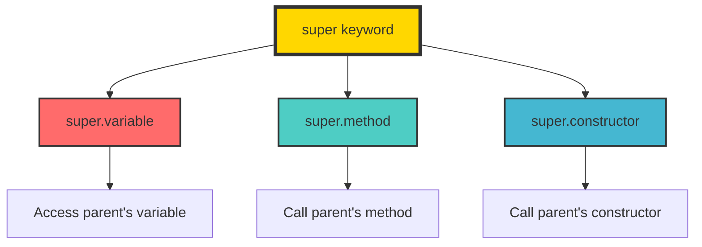
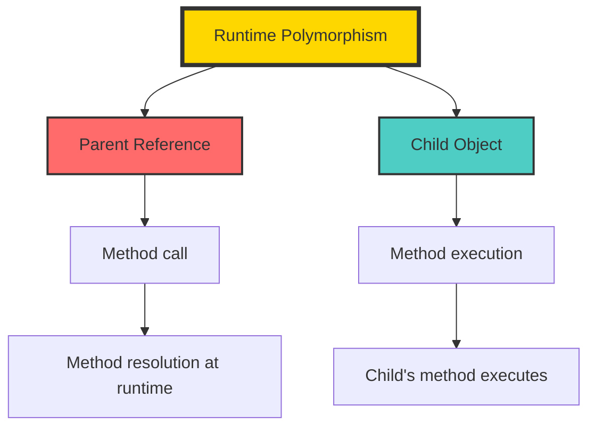
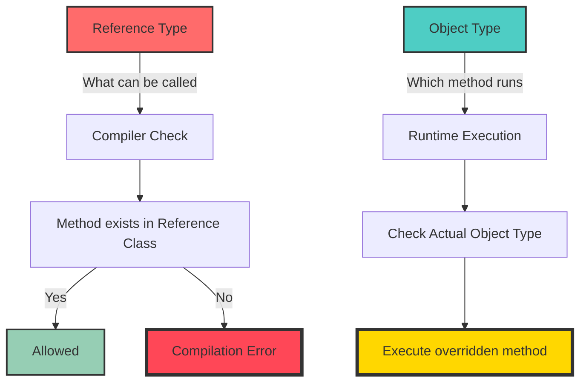
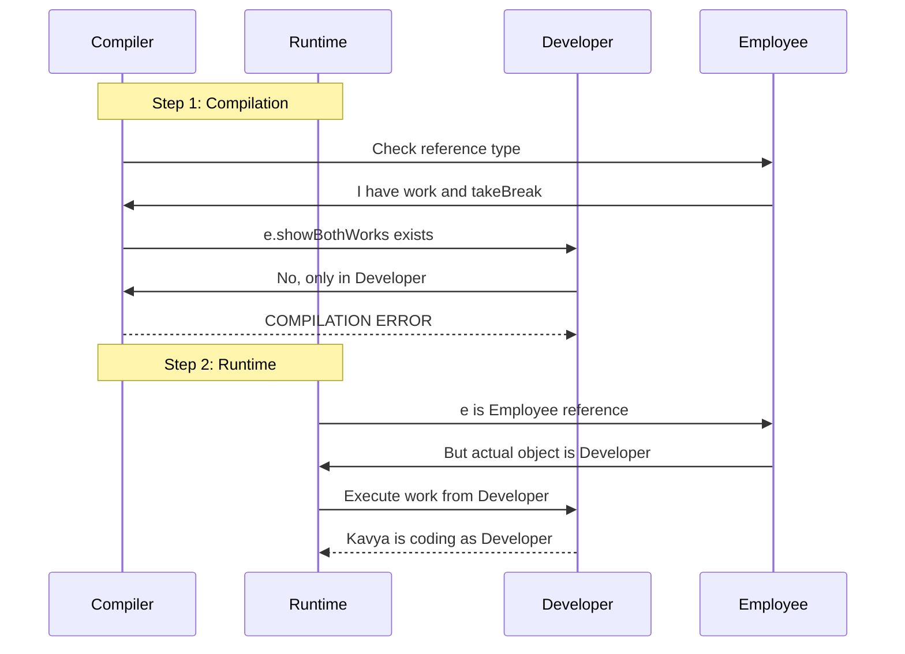
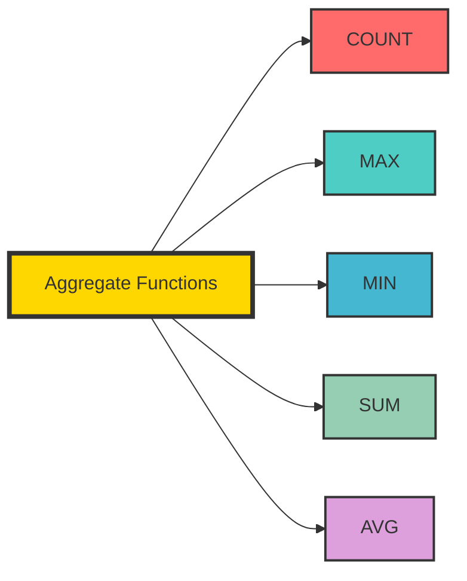
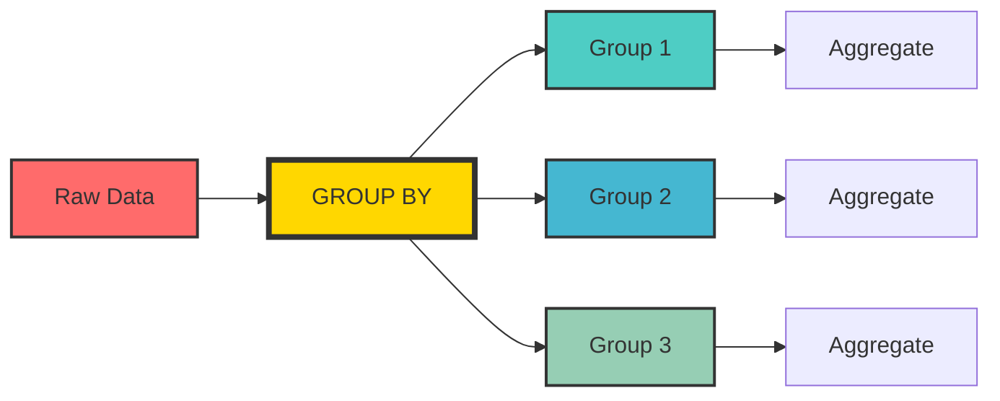

# ✨ Day 2 - OOP & SQL Deep Dive ✨

> *"The magic happens when concepts connect!"*

[](https://www.java.com/)
[](https://www.oracle.com/java/technologies/)
[](https://www.mysql.com/)
[]()

---

## 📚 Table of Contents

1. [Java Concepts](#-java-concepts)
   - [super Keyword](#-super-keyword)
   - [Method Overriding](#-method-overriding)
   - [Runtime Polymorphism](#-runtime-polymorphism)
   - [Reference vs Object Type](#-reference-vs-object-type)
2. [SQL Concepts](#-sql-concepts)
   - [Aggregate Functions](#-aggregate-functions)
   - [GROUP BY Clause](#-group-by-clause)
   - [HAVING Clause](#-having-clause)
   - [WHERE vs HAVING](#-where-vs-having)
3. [Practice Assignments](#-practice-assignments)
4. [Mistake Log](#-mistake-log)
5. [Summary](#-summary)

---

## ☕ Java Concepts

### 1. super Keyword

The `super` keyword in Java is a reference variable used to refer to the immediate parent class object.



#### 1.1 super.variable

Used to access parent class variables when they are hidden by child class variables.

**Example:**

```java
class Parent {
    String name = "Parent";
}

class Child extends Parent {
    String name = "Child";
    
    void display() {
        System.out.println(name);        // Prints: Child
        System.out.println(super.name);  // Prints: Parent
    }
}
```

#### 1.2 super.method()

Used to call parent class methods.

**Example:**

```java
class Parent {
    void show() {
        System.out.println("Parent's show method");
    }
}

class Child extends Parent {
    @Override
    void show() {
        super.show();  // Calls Parent's show method
        System.out.println("Child's show method");
    }
}
```

#### 1.3 super.constructor()

Used to call parent class constructor from child class constructor.

**Example:**

```java
class Parent {
    Parent() {
        System.out.println("Parent constructor");
    }
    
    Parent(String name) {
        System.out.println("Parent constructor with name: " + name);
    }
}

class Child extends Parent {
    Child() {
        super();  // Calls Parent's default constructor
        System.out.println("Child constructor");
    }
    
    Child(String name) {
        super(name);  // Calls Parent's parameterized constructor
        System.out.println("Child constructor with name: " + name);
    }
}
```

**Important Rules for super():**
- `super()` must be the first statement in the constructor
- If not written explicitly, Java automatically inserts `super()` as the first statement

---

### 2. Method Overriding

Method overriding allows a child class to provide a specific implementation of a method that is already defined in its parent class.

**Rules for Method Overriding:**
1. Method name must be same
2. Return type must be same (or covariant)
3. Parameter list must be same
4. Access modifier cannot be more restrictive
5. Cannot override `final` methods
6. Cannot override `static` methods

**Example:**

```java
class Animal {
    void sound() {
        System.out.println("Animal makes sound");
    }
    
    void eat() {
        System.out.println("Animal eats food");
    }
}

class Dog extends Animal {
    @Override
    void sound() {
        System.out.println("Dog barks");
    }
    
    // This is not overriding - it's method overloading
    void sound(String type) {
        System.out.println("Dog barks " + type);
    }
}

class Cat extends Animal {
    @Override
    void sound() {
        System.out.println("Cat meows");
    }
}
```

**Usage:**

```java
Animal a1 = new Animal();
a1.sound();  // Animal makes sound

Animal a2 = new Dog();
a2.sound();  // Dog barks

Animal a3 = new Cat();
a3.sound();  // Cat meows
```

---

### 3. Runtime Polymorphism

Runtime polymorphism (also known as dynamic method dispatch) is the process where a call to an overridden method is resolved at runtime rather than compile-time.



**Example:**

```java
class Employee {
    void work() {
        System.out.println("Employee is working");
    }
}

class Developer extends Employee {
    @Override
    void work() {
        System.out.println("Developer is coding");
    }
}

class Manager extends Employee {
    @Override
    void work() {
        System.out.println("Manager is managing");
    }
}

public class TestPolymorphism {
    public static void main(String[] args) {
        Employee e1 = new Developer();
        Employee e2 = new Manager();
        
        e1.work();  // Developer is coding
        e2.work();  // Manager is managing
    }
}
```

---

### 4. Reference vs Object Type

This is the most important concept to understand in polymorphism.



### 🔮 The Golden Rule

> **Reference type decides what can be called**
> **Object type decides which overridden method actually runs**

**Example to Understand:**

```java
class Employee {
    String name;
    
    Employee(String name) {
        this.name = name;
    }
    
    void work() {
        System.out.println(name + " is working as Employee");
    }
    
    void takeBreak() {
        System.out.println(name + " is taking a break");
    }
}

class Developer extends Employee {
    Developer(String name) {
        super(name);
    }
    
    @Override
    void work() {
        System.out.println(name + " is coding as Developer");
    }
    
    void showBothWorks() {
        this.work();     // Calls Developer's work
        super.work();    // Calls Employee's work
    }
    
    void debug() {
        System.out.println(name + " is debugging code");
    }
}

public class Main {
    public static void main(String[] args) {
        // Scenario 1: Developer reference
        Developer d = new Developer("Kavya");
        d.work();           // ✅ "Kavya is coding as Developer"
        d.showBothWorks();  // ✅ Works perfectly!
        d.debug();          // ✅ Works perfectly!
        
        // Scenario 2: Employee reference
        Employee e = new Developer("Kavya");
        e.work();           // ✅ "Kavya is coding as Developer"
        e.takeBreak();      // ✅ "Kavya is taking a break"
        // e.showBothWorks(); // ❌ COMPILATION ERROR!
        // e.debug();         // ❌ COMPILATION ERROR!
        
        // Scenario 3: Why the error?
        // Even though actual object is Developer,
        // reference is Employee, so compiler only sees Employee methods
    }
}
```

### 🎯 Why This Matters



---

## 🗄️ SQL Concepts

### 1. Aggregate Functions

Aggregate functions perform calculations on a set of values and return a single value.



#### Example Table: Employee

| EmpID | Name | Department | Salary |
|-------|------|------------|--------|
| 1 | Sai | AI | 50000 |
| 2 | Rahul | Java | 70000 |
| 3 | Priya | AI | 60000 |
| 4 | Arjun | Data | 80000 |
| 5 | Kavya | Java | 75000 |

#### 1.1 COUNT()

Counts the number of rows.

```sql
-- Count all employees
SELECT COUNT(*) FROM Employee;
-- Result: 5

-- Count employees in AI department
SELECT COUNT(*) FROM Employee WHERE Department = 'AI';
-- Result: 2

-- Count distinct departments
SELECT COUNT(DISTINCT Department) FROM Employee;
-- Result: 3
```

#### 1.2 MAX()

Returns the maximum value.

```sql
-- Highest salary
SELECT MAX(Salary) FROM Employee;
-- Result: 80000

-- Highest salary in Java department
SELECT MAX(Salary) FROM Employee WHERE Department = 'Java';
-- Result: 75000
```

#### 1.3 MIN()

Returns the minimum value.

```sql
-- Lowest salary
SELECT MIN(Salary) FROM Employee;
-- Result: 50000

-- Lowest salary in AI department
SELECT MIN(Salary) FROM Employee WHERE Department = 'AI';
-- Result: 50000
```

#### 1.4 SUM()

Returns the sum of values.

```sql
-- Total salary of all employees
SELECT SUM(Salary) FROM Employee;
-- Result: 335000

-- Total salary of Java department
SELECT SUM(Salary) FROM Employee WHERE Department = 'Java';
-- Result: 145000
```

#### 1.5 AVG()

Returns the average value.

```sql
-- Average salary of all employees
SELECT AVG(Salary) FROM Employee;
-- Result: 67000

-- Average salary of AI department
SELECT AVG(Salary) FROM Employee WHERE Department = 'AI';
-- Result: 55000
```

---

### 2. GROUP BY Clause

`GROUP BY` groups rows that have the same values in specified columns into summary rows.



**Examples:**

```sql
-- Count employees per department
SELECT Department, COUNT(*) as EmployeeCount
FROM Employee
GROUP BY Department;

-- Result:
-- AI    | 2
-- Java  | 2
-- Data  | 1

-- Average salary per department
SELECT Department, AVG(Salary) as AvgSalary
FROM Employee
GROUP BY Department;

-- Result:
-- AI    | 55000
-- Java  | 72500
-- Data  | 80000

-- Total salary per department
SELECT Department, SUM(Salary) as TotalSalary
FROM Employee
GROUP BY Department;

-- Result:
-- AI    | 110000
-- Java  | 145000
-- Data  | 80000

-- Multiple aggregates per department
SELECT 
    Department,
    COUNT(*) as EmployeeCount,
    AVG(Salary) as AvgSalary,
    MAX(Salary) as MaxSalary,
    MIN(Salary) as MinSalary
FROM Employee
GROUP BY Department;
```

---

### 3. HAVING Clause

`HAVING` is used to filter groups created by `GROUP BY`. It works like `WHERE` but for groups.


**Examples:**

```sql
-- Departments with more than 1 employee
SELECT Department, COUNT(*) as EmployeeCount
FROM Employee
GROUP BY Department
HAVING COUNT(*) > 1;

-- Result:
-- AI    | 2
-- Java  | 2

-- Departments with average salary > 60000
SELECT Department, AVG(Salary) as AvgSalary
FROM Employee
GROUP BY Department
HAVING AVG(Salary) > 60000;

-- Result:
-- Java  | 72500
-- Data  | 80000

-- Departments with total salary > 100000
SELECT Department, SUM(Salary) as TotalSalary
FROM Employee
GROUP BY Department
HAVING SUM(Salary) > 100000;

-- Result:
-- AI    | 110000
-- Java  | 145000
```

---

### 4. WHERE vs HAVING

| Feature | WHERE | HAVING |
|---------|-------|--------|
| Used for | Filtering rows | Filtering groups |
| Applied | Before GROUP BY | After GROUP BY |
| Can use | Column names, expressions, subqueries | Aggregate functions, column names |
| Aggregate functions | ❌ Cannot use | ✅ Can use |
| GROUP BY needed | Not required | Required |

**Example Comparing Both:**

```sql
-- Find departments with employees earning > 60000
SELECT Department
FROM Employee
WHERE Salary > 60000
GROUP BY Department;

-- Find departments where average salary > 65000
SELECT Department, AVG(Salary) as AvgSalary
FROM Employee
GROUP BY Department
HAVING AVG(Salary) > 65000;

-- Complex query with both WHERE and HAVING
SELECT Department, AVG(Salary) as AvgSalary
FROM Employee
WHERE Salary > 50000  -- First filter: only consider employees with salary > 50000
GROUP BY Department   -- Then group by department
HAVING AVG(Salary) > 65000;  -- Finally, filter groups with avg > 65000
```

---

## 💡 The Complete Polymorphism Example

### Day 2 Java Assignment - Complete Solution

**Problem Statement:**
Create a system with `Employee` and `Developer` classes demonstrating:
1. `super` keyword usage
2. Method overriding
3. Runtime polymorphism
4. Reference vs Object type understanding

**Complete Solution:**

```java
// Parent Class
class Employee {
    private String name;
    private double salary;
    
    // Constructor
    Employee(String name, double salary) {
        this.name = name;
        this.salary = salary;
    }
    
    // Getter
    public String getName() {
        return name;
    }
    
    public double getSalary() {
        return salary;
    }
    
    // Method to be overridden
    void work() {
        System.out.println(name + " is working as Employee");
    }
    
    void takeBreak() {
        System.out.println(name + " is taking a break");
    }
    
    void displayDetails() {
        System.out.println("Name: " + name);
        System.out.println("Salary: " + salary);
    }
}

// Child Class
class Developer extends Employee {
    private String programmingLanguage;
    
    // Constructor with super()
    Developer(String name, double salary, String programmingLanguage) {
        super(name, salary);  // Calling parent constructor
        this.programmingLanguage = programmingLanguage;
    }
    
    // Getter
    public String getProgrammingLanguage() {
        return programmingLanguage;
    }
    
    // Overriding work() method
    @Override
    void work() {
        System.out.println(getName() + " is coding in " + programmingLanguage);
    }
    
    // Child-specific method
    void showBothWorks() {
        this.work();     // Calls Developer's work
        super.work();    // Calls Employee's work
    }
    
    // Child-specific method
    void debug() {
        System.out.println(getName() + " is debugging " + programmingLanguage + " code");
    }
    
    // Overriding displayDetails to add more info
    @Override
    void displayDetails() {
        super.displayDetails();  // Calling parent's displayDetails
        System.out.println("Programming Language: " + programmingLanguage);
    }
}

// Main Class
public class Day2Assignment {
    public static void main(String[] args) {
        System.out.println("=== Developer Reference ===");
        Developer d = new Developer("Kavya", 75000, "Java");
        d.work();           // Overridden method
        d.showBothWorks();  // Child-specific method
        d.debug();          // Child-specific method
        d.displayDetails(); // Overridden method with super
        
        System.out.println("\n=== Employee Reference ===");
        Employee e = new Developer("Arjun", 80000, "Python");
        e.work();           // Runtime polymorphism - Developer's work runs
        e.takeBreak();      // Inherited from Employee
        e.displayDetails(); // Overridden method runs
        
        // e.debug();       // ❌ ERROR: Employee reference doesn't have debug()
        // e.showBothWorks(); // ❌ ERROR: Employee reference doesn't have showBothWorks()
        
        System.out.println("\n=== Polymorphism in Action ===");
        Employee[] employees = {
            new Employee("Sai", 50000),
            new Developer("Priya", 60000, "JavaScript"),
            new Employee("Rahul", 70000),
            new Developer("Kavya", 75000, "Java")
        };
        
        for (Employee emp : employees) {
            emp.work();  // Different behavior based on actual object type
        }
    }
}
```

**Output:**
```
=== Developer Reference ===
Kavya is coding in Java
Kavya is coding in Java
Kavya is working as Employee
Kavya is debugging Java code
Name: Kavya
Salary: 75000.0
Programming Language: Java

=== Employee Reference ===
Arjun is coding in Python
Arjun is taking a break
Name: Arjun
Salary: 80000.0
Programming Language: Python

=== Polymorphism in Action ===
Sai is working as Employee
Priya is coding in JavaScript
Rahul is working as Employee
Kavya is coding in Java
```

---

## 📊 Day 2 SQL Assignment - Complete Solution

**Problem Statement:** Given the Employee table below, write SQL queries for various operations.

### Employee Table

| EmpID | Name | Department | Salary | Location |
|-------|------|------------|--------|----------|
| 1 | Sai | AI | 50000 | Bangalore |
| 2 | Rahul | Java | 70000 | Hyderabad |
| 3 | Priya | AI | 60000 | Bangalore |
| 4 | Arjun | Data | 80000 | Pune |
| 5 | Kavya | Java | 75000 | Hyderabad |
| 6 | Deepak | AI | 65000 | Bangalore |
| 7 | Sneha | Data | 85000 | Pune |

### Questions and Solutions

#### 1. Count total employees
```sql
SELECT COUNT(*) as TotalEmployees FROM Employee;
-- Result: 7
```

#### 2. Count employees per department
```sql
SELECT Department, COUNT(*) as EmployeeCount
FROM Employee
GROUP BY Department;
-- Result: AI: 3, Java: 2, Data: 2
```

#### 3. Average salary per department
```sql
SELECT Department, AVG(Salary) as AvgSalary
FROM Employee
GROUP BY Department;
-- Result: AI: 58333.33, Java: 72500, Data: 82500
```

#### 4. Highest salary per department
```sql
SELECT Department, MAX(Salary) as MaxSalary
FROM Employee
GROUP BY Department;
-- Result: AI: 65000, Java: 75000, Data: 85000
```

#### 5. Lowest salary per department
```sql
SELECT Department, MIN(Salary) as MinSalary
FROM Employee
GROUP BY Department;
-- Result: AI: 50000, Java: 70000, Data: 80000
```

#### 6. Total salary per department
```sql
SELECT Department, SUM(Salary) as TotalSalary
FROM Employee
GROUP BY Department;
-- Result: AI: 175000, Java: 145000, Data: 165000
```

#### 7. Departments with more than 2 employees
```sql
SELECT Department, COUNT(*) as EmployeeCount
FROM Employee
GROUP BY Department
HAVING COUNT(*) > 2;
-- Result: AI: 3
```

#### 8. Departments with average salary > 60000
```sql
SELECT Department, AVG(Salary) as AvgSalary
FROM Employee
GROUP BY Department
HAVING AVG(Salary) > 60000;
-- Result: Java: 72500, Data: 82500
```

#### 9. Employee count per location
```sql
SELECT Location, COUNT(*) as EmployeeCount
FROM Employee
GROUP BY Location;
-- Result: Bangalore: 3, Hyderabad: 2, Pune: 2
```

#### 10. Average salary per location
```sql
SELECT Location, AVG(Salary) as AvgSalary
FROM Employee
GROUP BY Location;
-- Result: Bangalore: 58333.33, Hyderabad: 72500, Pune: 82500
```

#### 11. Locations with total salary > 150000
```sql
SELECT Location, SUM(Salary) as TotalSalary
FROM Employee
GROUP BY Location
HAVING SUM(Salary) > 150000;
-- Result: Bangalore: 175000
```

#### 12. Department-wise employee count and average salary (filtered by salary > 55000)
```sql
SELECT 
    Department,
    COUNT(*) as EmployeeCount,
    AVG(Salary) as AvgSalary
FROM Employee
WHERE Salary > 55000
GROUP BY Department;
-- Result: AI: 2 (60000, 65000), Java: 2 (70000, 75000), Data: 2 (80000, 85000)
```

#### 13. Department-wise total salary where max salary > 70000
```sql
SELECT Department, SUM(Salary) as TotalSalary
FROM Employee
GROUP BY Department
HAVING MAX(Salary) > 70000;
-- Result: Java: 145000, Data: 165000
```

#### 14. Complex query with multiple conditions
```sql
SELECT 
    Department,
    COUNT(*) as EmployeeCount,
    AVG(Salary) as AvgSalary,
    MAX(Salary) as MaxSalary,
    MIN(Salary) as MinSalary
FROM Employee
WHERE Location IN ('Bangalore', 'Hyderabad')
GROUP BY Department
HAVING COUNT(*) >= 2;
-- Result: 
-- AI: 2 employees, Avg: 55000, Max: 60000, Min: 50000
-- Java: 2 employees, Avg: 72500, Max: 75000, Min: 70000
```

---

## 🎯 Practice Corner

### Java Challenge 1: Understanding super

<details>
<summary><b>🔮 What will be the output?</b></summary>

```java
class A {
    int x = 10;
    void display() {
        System.out.println("A's display");
    }
    A() {
        System.out.println("A's constructor");
    }
}

class B extends A {
    int x = 20;
    B() {
        super();
        System.out.println("B's constructor");
    }
    void display() {
        System.out.println("B's display");
    }
    void show() {
        System.out.println("x = " + x);
        System.out.println("super.x = " + super.x);
        this.display();
        super.display();
    }
}

public class Test {
    public static void main(String[] args) {
        B b = new B();
        b.show();
    }
}
```

**Output:**
```
A's constructor
B's constructor
x = 20
super.x = 10
B's display
A's display
```

</details>

### Java Challenge 2: Polymorphism

<details>
<summary><b>🔮 Can you predict the output?</b></summary>

```java
class Animal {
    void sound() {
        System.out.println("Animal sound");
    }
    void eat() {
        System.out.println("Animal eats");
    }
}

class Dog extends Animal {
    @Override
    void sound() {
        System.out.println("Dog barks");
    }
    void play() {
        System.out.println("Dog plays");
    }
}

public class TestPolymorphism {
    public static void main(String[] args) {
        Animal a = new Dog();
        a.sound();    // What prints?
        a.eat();      // What prints?
        // a.play();  // Would this work?
    }
}
```

**Answer:**
- `a.sound()` → "Dog barks" (Overridden method runs)
- `a.eat()` → "Animal eats" (Inherited method)
- `a.play()` → ❌ Compilation Error! (play() not in Animal class)

</details>

### SQL Challenge 1: Complete Query

<details>
<summary><b>🗄️ Can you write the complete query?</b></summary>

**Question:** Write a query to find departments with:
1. More than 2 employees
2. Average salary > 65000
3. Total salary < 200000

```sql
SELECT 
    Department,
    COUNT(*) as EmployeeCount,
    AVG(Salary) as AvgSalary,
    SUM(Salary) as TotalSalary
FROM Employee
GROUP BY Department
HAVING 
    COUNT(*) > 2 
    AND AVG(Salary) > 65000 
    AND SUM(Salary) < 200000;
```

</details>

### SQL Challenge 2: Complex Filter

<details>
<summary><b>🗄️ Can you write this query?</b></summary>

**Question:** Find locations where:
1. Total employees > 1
2. Max salary > 70000
3. Min salary > 50000

```sql
SELECT 
    Location,
    COUNT(*) as EmployeeCount,
    MAX(Salary) as MaxSalary,
    MIN(Salary) as MinSalary
FROM Employee
GROUP BY Location
HAVING 
    COUNT(*) > 1 
    AND MAX(Salary) > 70000 
    AND MIN(Salary) > 50000;
```

</details>

---

## ❌ Mistake Log - What I Learned Today

### Java Mistakes

#### Mistake 1: Forgetting to call super()

**Incorrect:**
```java
class Child extends Parent {
    Child(String name) {
        // super() not called
        this.name = name;
    }
}
```

**Correct:**
```java
class Child extends Parent {
    Child(String name) {
        super(name);  // Must call super() first
        this.name = name;
    }
}
```

**Lesson:** If parent doesn't have default constructor, child must explicitly call super() with parameters.

---

#### Mistake 2: Wrong method overriding

**Incorrect:**
```java
class Parent {
    void display(int x) { }
}

class Child extends Parent {
    void display() { }  // This is overloading, not overriding
}
```

**Correct:**
```java
class Parent {
    void display(int x) { }
}

class Child extends Parent {
    @Override
    void display(int x) { }  // Same signature - proper overriding
}
```

**Lesson:** Method signature must match exactly for overriding.

---

#### Mistake 3: Reference type confusion

**Incorrect:**
```java
Employee e = new Developer("Kavya");
e.showBothWorks();  // ❌ ERROR: showBothWorks() not in Employee
```

**Correct:**
```java
Developer d = new Developer("Kavya");
d.showBothWorks();  // ✅ Works!

// OR if you need Employee reference:
Employee e = new Developer("Kavya");
((Developer) e).showBothWorks();  // ✅ Casting works
```

**Lesson:** Reference type determines what methods can be called.

---

### SQL Mistakes

#### Mistake 1: Using WHERE with aggregate functions

**Incorrect:**
```sql
SELECT Department
FROM Employee
WHERE COUNT(*) > 2  -- ❌ Cannot use aggregate in WHERE
GROUP BY Department;
```

**Correct:**
```sql
SELECT Department
FROM Employee
GROUP BY Department
HAVING COUNT(*) > 2;  -- ✅ Use HAVING for aggregates
```

---

#### Mistake 2: Missing GROUP BY columns

**Incorrect:**
```sql
SELECT Department, Name  -- ❌ Name not in GROUP BY
FROM Employee
GROUP BY Department;
```

**Correct:**
```sql
SELECT Department, COUNT(*)  -- ✅ Aggregates allowed
FROM Employee
GROUP BY Department;
```

---

#### Mistake 3: Order of clauses

**Incorrect:**
```sql
SELECT *
FROM Employee
HAVING Salary > 50000  -- ❌ HAVING before GROUP BY
GROUP BY Department;
```

**Correct:**
```sql
SELECT Department, AVG(Salary)
FROM Employee
WHERE Salary > 50000   -- ✅ WHERE first
GROUP BY Department;   -- ✅ GROUP BY second
-- HAVING comes after GROUP BY (optional)
```

**Correct Order:**
1. `SELECT`
2. `FROM`
3. `WHERE`
4. `GROUP BY`
5. `HAVING`
6. `ORDER BY`

---

## 📊 Progress Tracker Update

| Concept | Status | Confidence |
|---------|--------|------------|
| super keyword | ✅ Locked | ⭐⭐⭐⭐ |
| Method Overriding | ✅ Locked | ⭐⭐⭐⭐ |
| Runtime Polymorphism | ✅ Locked | ⭐⭐⭐⭐ |
| Reference vs Object Type | ✅ Locked | ⭐⭐⭐⭐ |
| Aggregate Functions | ✅ Locked | ⭐⭐⭐⭐⭐ |
| GROUP BY | ✅ Locked | ⭐⭐⭐⭐⭐ |
| HAVING | ✅ Locked | ⭐⭐⭐⭐⭐ |
| WHERE vs HAVING | ✅ Locked | ⭐⭐⭐⭐⭐ |

---

## 🎨 The Memory Magic

### Java Memory Aid

```
┌─────────────────────────────────────────────┐
│     POLYMORPHISM MAGIC FORMULA              │
│                                             │
│  📌 Reference Type → What can be called     │
│  📌 Object Type    → What actually runs     │
│                                             │
│  Example:                                   │
│  Employee e = new Developer();             │
│  e.work();                                  │
│  ↑                  ↑                       │
│  Reference         Object                   │
│  decides           decides                  │
│  availability      execution                │
│                                             │
│  ✅ e.work() → Compiler says YES           │
│  ✅ e.work() → Runtime runs Developer's    │
│                 version                     │
└─────────────────────────────────────────────┘
```

### SQL Memory Aid

```
┌─────────────────────────────────────────────┐
│     SQL CLAUSE ORDER MAGIC                  │
│                                             │
│  1️⃣ SELECT   - What to show                │
│  2️⃣ FROM     - Which table                 │
│  3️⃣ WHERE    - Filter rows BEFORE grouping │
│  4️⃣ GROUP BY - Group rows                  │
│  5️⃣ HAVING   - Filter groups AFTER grouping│
│  6️⃣ ORDER BY - Sort results                │
│                                             │
│  🚫 WHERE cannot use aggregates             │
│  ✅ HAVING can use aggregates               │
└─────────────────────────────────────────────┘
```

---

## 📝 Day 2 Summary

### ☕ Java Concepts Mastered

- ✅ **super keyword** - Access parent's variables, methods, constructors
- ✅ **Method Overriding** - Child provides specific implementation
- ✅ **Runtime Polymorphism** - Method resolution at runtime
- ✅ **Reference vs Object Type** - Critical distinction for polymorphism
- ✅ **Compilation vs Runtime** - Different behaviors

### 🗄️ SQL Concepts Mastered

- ✅ **Aggregate Functions** - COUNT, MAX, MIN, SUM, AVG
- ✅ **GROUP BY** - Group rows for aggregation
- ✅ **HAVING** - Filter groups after GROUP BY
- ✅ **WHERE vs HAVING** - When to use which
- ✅ **Clause Order** - Proper sequence in queries

### 🎯 Key Takeaways

1. **Reference type** determines method availability (compile-time)
2. **Object type** determines method execution (runtime)
3. `super` accesses parent class members
4. Aggregate functions summarize data
5. `GROUP BY` groups data, `HAVING` filters groups

---

## 🏆 Score Upgrade

### Day 2 Score: **7/10 → 8.5/10** 🎉

| Aspect | Before | After |
|--------|--------|-------|
| super keyword | ⭐⭐⭐ | ⭐⭐⭐⭐ |
| Polymorphism | ⭐⭐ | ⭐⭐⭐⭐ |
| Reference/Object Types | ⭐ | ⭐⭐⭐⭐ |
| Aggregate Functions | ⭐⭐⭐⭐ | ⭐⭐⭐⭐⭐ |
| GROUP BY & HAVING | ⭐⭐⭐ | ⭐⭐⭐⭐⭐ |

---

## ✅ Day 2 Checklist

- [x] super variable understood
- [x] super method understood
- [x] super constructor understood
- [x] Method overriding practiced
- [x] Reference vs Object type understood
- [x] showBothWorks correction applied
- [x] Aggregate functions practiced
- [x] GROUP BY & HAVING practiced
- [x] WHERE vs HAVING understood
- [x] Mistakes documented
- [x] Pushed to GitHub

---

## 🚀 What's Next - Day 3 Preview

### ☕ Java Day 3
- `final` keyword
- `abstract` class
- Abstract methods
- Interface basics
- Abstraction vs Encapsulation vs Inheritance vs Polymorphism

### 🗄️ SQL Day 3
- `IN` operator
- `BETWEEN` operator
- `LIKE`
