# ✨ Day 3 - Abstract Classes, Interfaces & SQL Patterns ✨

> *"The bridge between theory and practice is built with corrections!"*

[](https://www.java.com/)
[](https://www.oracle.com/java/technologies/)
[](https://www.oracle.com/java/technologies/)
[](https://www.mysql.com/)

---

## 📚 Table of Contents

1. [Java Concepts](#-java-concepts)
   - [Abstract Classes](#-abstract-classes)
   - [Abstract Methods](#-abstract-methods)
   - [Interfaces](#-interfaces)
   - [Multiple Inheritance with Interfaces](#-multiple-inheritance-with-interfaces)
   - [Abstract vs Interface](#-abstract-vs-interface)
2. [SQL Concepts](#-sql-concepts)
   - [IN Operator](#-in-operator)
   - [BETWEEN Operator](#-between-operator)
   - [LIKE Operator](#-like-operator)
   - [Pattern Matching](#-pattern-matching)
   - [IS NULL & IS NOT NULL](#-is-null--is-not-null)
3. [Practice Assignments](#-practice-assignments)
4. [Mistake Log](#-mistake-log)
5. [Summary](#-summary)

---

## ☕ Java Concepts

### 1. Abstract Classes

An abstract class is a class that cannot be instantiated (you cannot create objects of it). It is used to provide a common base for subclasses.

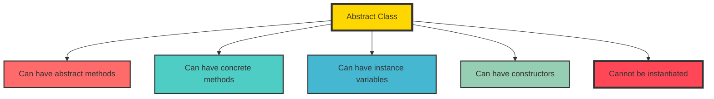

#### 1.1 Abstract Class Rules

1. Cannot be instantiated
2. May contain abstract methods (methods without body)
3. May contain concrete methods (methods with body)
4. May contain instance variables
5. May have constructors (called by subclasses)
6. A subclass must implement all abstract methods of its parent
7. If a subclass doesn't implement all abstract methods, it must also be abstract

**Syntax:**
```java
abstract class ClassName {
    // Abstract method - no body
    abstract void methodName();
    
    // Concrete method - has body
    void concreteMethod() {
        // implementation
    }
}
```

#### 1.2 Example: Abstract Class

```java
// Abstract class
abstract class Employee {
    private String name;
    private double salary;
    
    // Constructor
    Employee(String name, double salary) {
        this.name = name;
        this.salary = salary;
    }
    
    // Concrete method - has implementation
    public String getName() {
        return name;
    }
    
    public double getSalary() {
        return salary;
    }
    
    // Abstract method - no body
    abstract void work();
    
    // Concrete method
    void displayDetails() {
        System.out.println("Name: " + name);
        System.out.println("Salary: " + salary);
    }
}

// Concrete subclass
class Developer extends Employee {
    private String programmingLanguage;
    
    Developer(String name, double salary, String programmingLanguage) {
        super(name, salary);
        this.programmingLanguage = programmingLanguage;
    }
    
    // Must implement abstract method
    @Override
    void work() {
        System.out.println(getName() + " is coding in " + programmingLanguage);
    }
    
    void debug() {
        System.out.println(getName() + " is debugging code");
    }
}

// Another concrete subclass
class Manager extends Employee {
    private int teamSize;
    
    Manager(String name, double salary, int teamSize) {
        super(name, salary);
        this.teamSize = teamSize;
    }
    
    // Must implement abstract method
    @Override
    void work() {
        System.out.println(getName() + " is managing a team of " + teamSize + " members");
    }
}
```

**Usage:**
```java
public class TestEmployee {
    public static void main(String[] args) {
        // ❌ Cannot create object of abstract class
        // Employee e = new Employee("Kavya", 75000); // ERROR!
        
        // ✅ Can create object of concrete subclass
        Developer d = new Developer("Kavya", 75000, "Java");
        d.work();  // "Kavya is coding in Java"
        d.displayDetails();  // Inherited concrete method
        
        Manager m = new Manager("Arjun", 80000, 5);
        m.work();  // "Arjun is managing a team of 5 members"
        
        // ✅ Polymorphism with abstract class
        Employee e1 = new Developer("Sai", 70000, "Python");
        Employee e2 = new Manager("Priya", 90000, 10);
        
        e1.work();  // "Sai is coding in Python"
        e2.work();  // "Priya is managing a team of 10 members"
    }
}
```

---

### 2. Abstract Methods

An abstract method is a method that is declared without an implementation (no body).

**Rules for Abstract Methods:**
1. Cannot have a body (no `{}`)
2. Must be declared inside an abstract class or interface
3. Must be implemented by the first concrete subclass
4. Cannot be `private`
5. Cannot be `static`
6. Cannot be `final`

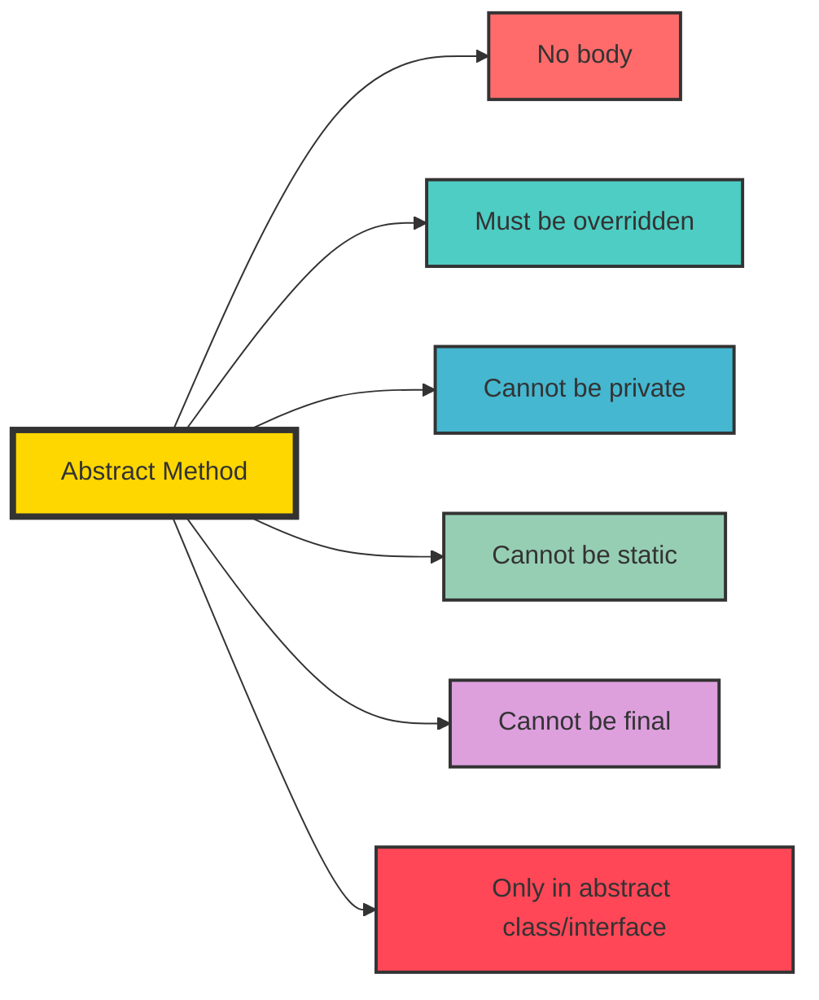

**Example:**
```java
abstract class Animal {
    // Abstract method - no body
    abstract void sound();
    
    // Abstract method with parameters
    abstract void eat(String food);
    
    // Abstract method with return type
    abstract int getAge();
}

class Dog extends Animal {
    // Must implement all abstract methods
    @Override
    void sound() {
        System.out.println("Dog barks");
    }
    
    @Override
    void eat(String food) {
        System.out.println("Dog eats " + food);
    }
    
    @Override
    int getAge() {
        return 5;
    }
}
```

---

### 3. Interfaces

An interface is a completely abstract type that defines a contract for classes to implement.

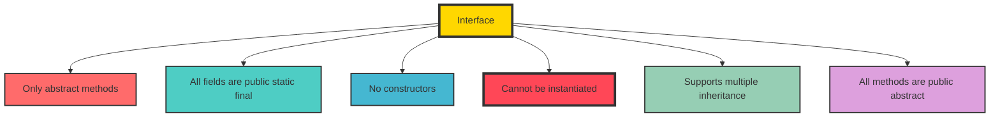

#### 3.1 Interface Rules

1. All methods are implicitly `public abstract` (until Java 8)
2. All fields are implicitly `public static final`
3. Cannot have constructors
4. Cannot be instantiated
5. A class can implement multiple interfaces
6. An interface can extend multiple interfaces
7. All methods must be implemented by the implementing class

**Syntax:**
```java
interface InterfaceName {
    // Constant (public static final)
    int CONSTANT = 100;
    
    // Abstract method
    void methodName();
}

class ClassName implements InterfaceName {
    // Must implement all interface methods
    @Override
    public void methodName() {
        // implementation
    }
}
```

#### 3.2 Example: Interface

```java
// Interface 1
interface Login {
    void login();
    void logout();
}

// Interface 2
interface Report {
    void generateReport();
    void exportReport();
}

// Interface 3
interface Workable {
    void work();
}

// Concrete class implementing multiple interfaces
class Developer extends Employee implements Login, Report, Workable {
    private String programmingLanguage;
    
    Developer(String name, double salary, String programmingLanguage) {
        super(name, salary);
        this.programmingLanguage = programmingLanguage;
    }
    
    // From Employee abstract class
    @Override
    void work() {
        System.out.println(getName() + " is coding in " + programmingLanguage);
    }
    
    // From Login interface
    @Override
    public void login() {
        System.out.println(getName() + " logged in");
    }
    
    @Override
    public void logout() {
        System.out.println(getName() + " logged out");
    }
    
    // From Report interface
    @Override
    public void generateReport() {
        System.out.println(getName() + " generated report");
    }
    
    @Override
    public void exportReport() {
        System.out.println(getName() + " exported report");
    }
    
    // From Workable interface
    @Override
    public void work() {
        System.out.println(getName() + " is working as Developer");
    }
}
```

#### 3.3 Multiple Interface Inheritance

Interfaces support multiple inheritance through extension.

```java
interface A {
    void methodA();
}

interface B {
    void methodB();
}

// Interface extending multiple interfaces
interface C extends A, B {
    void methodC();
}

// Class implementing multiple interfaces
class D implements A, B, C {
    @Override
    public void methodA() {
        System.out.println("Method A");
    }
    
    @Override
    public void methodB() {
        System.out.println("Method B");
    }
    
    @Override
    public void methodC() {
        System.out.println("Method C");
    }
}
```

---

### 4. Abstract Class vs Interface

This is one of the most common interview questions!

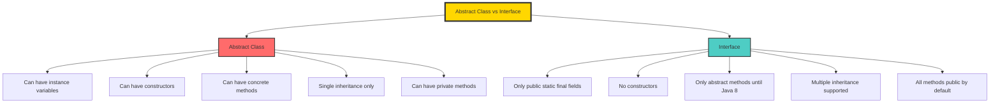

| Feature | Abstract Class | Interface |
|---------|---------------|-----------|
| **Instantiation** | Cannot instantiate | Cannot instantiate |
| **Fields** | Can have instance variables | Only `public static final` |
| **Constructors** | Can have constructors | No constructors |
| **Methods** | Can have abstract & concrete | All abstract (until Java 8) |
| **Inheritance** | Single inheritance | Multiple inheritance |
| **Access Modifiers** | All access modifiers | Only `public` |
| **When to use** | Share code among related classes | Define a contract for unrelated classes |

**Complete Example:**
```java
// Abstract class
abstract class Vehicle {
    String brand;
    
    Vehicle(String brand) {
        this.brand = brand;
    }
    
    abstract void start();  // Abstract method
    
    void stop() {  // Concrete method
        System.out.println(brand + " vehicle stopped");
    }
}

// Interface
interface GPS {
    void navigate(String destination);
}

interface Bluetooth {
    void connectDevice();
}

// Class extends abstract class and implements interfaces
class Car extends Vehicle implements GPS, Bluetooth {
    Car(String brand) {
        super(brand);
    }
    
    @Override
    void start() {
        System.out.println(brand + " car started");
    }
    
    @Override
    public void navigate(String destination) {
        System.out.println(brand + " navigating to " + destination);
    }
    
    @Override
    public void connectDevice() {
        System.out.println(brand + " connected to Bluetooth");
    }
}
```

---

### 5. Why Abstract Class Cannot Be Instantiated

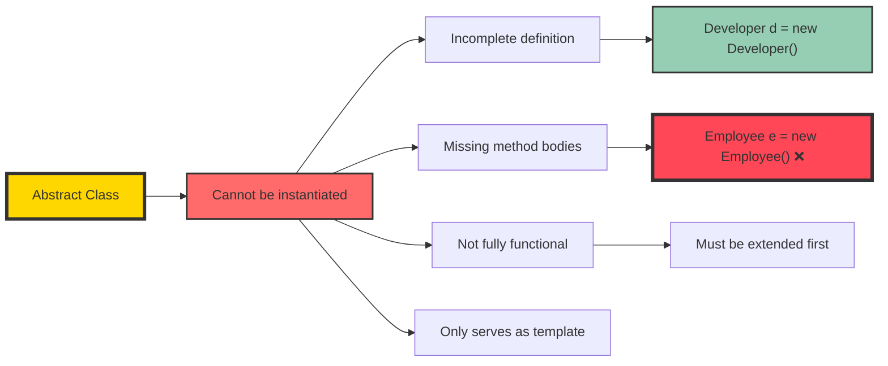

**Why?**
1. Abstract classes are incomplete (they have abstract methods without bodies)
2. It doesn't make sense to create an object of something incomplete
3. The object would have abstract methods that can't be called
4. They serve as templates for subclasses to complete

**Example:**
```java
abstract class Employee {
    abstract void work();
}

// ❌ This doesn't make sense
// Employee e = new Employee(); // ERROR: Cannot instantiate

// ✅ This is correct
class Developer extends Employee {
    @Override
    void work() {
        System.out.println("Working");
    }
}

Developer d = new Developer(); // ✅ Valid
Employee e = new Developer();  // ✅ Valid (polymorphism)
```

---

## 🗄️ SQL Concepts

### 1. IN Operator

The `IN` operator allows you to specify multiple values in a WHERE clause.

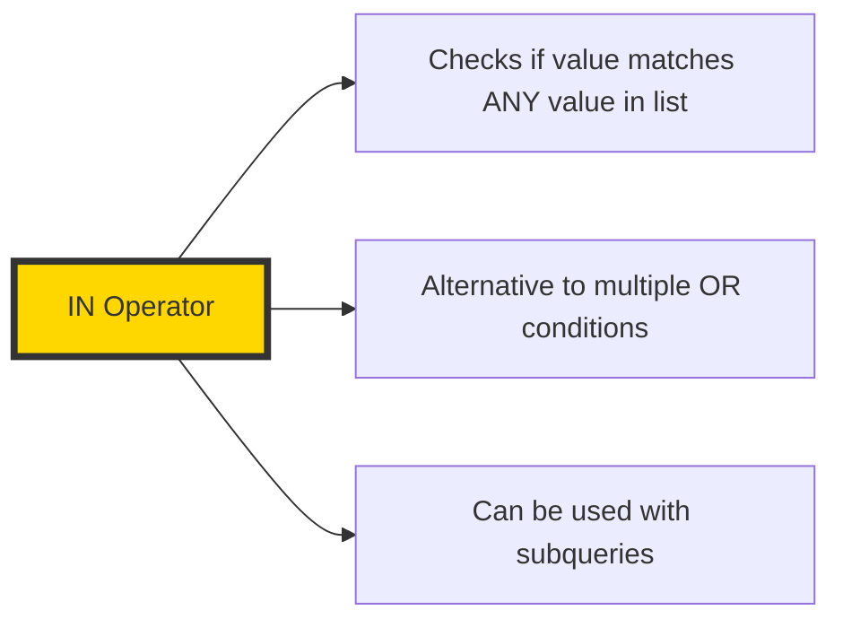

**Syntax:**
```sql
SELECT column1, column2
FROM table_name
WHERE column_name IN (value1, value2, value3, ...);
```

**Example Table: Employee**

| EmpID | Name | Department | Salary | Location |
|-------|------|------------|--------|----------|
| 1 | Sai | AI | 50000 | Bangalore |
| 2 | Rahul | Java | 70000 | Hyderabad |
| 3 | Priya | AI | 60000 | Bangalore |
| 4 | Arjun | Data | 80000 | Pune |
| 5 | Kavya | Java | 75000 | Hyderabad |
| 6 | Anmol | AI | 65000 | Bangalore |
| 7 | Unni | Data | 85000 | Pune |

**Examples:**
```sql
-- Employees in specific departments
SELECT *
FROM Employee
WHERE Department IN ('AI', 'Java');

-- Equivalent to:
SELECT *
FROM Employee
WHERE Department = 'AI' OR Department = 'Java';

-- Employees from specific locations
SELECT *
FROM Employee
WHERE Location IN ('Bangalore', 'Hyderabad');

-- Employees with specific salaries
SELECT *
FROM Employee
WHERE Salary IN (50000, 70000, 80000);

-- NOT IN - employees not in these departments
SELECT *
FROM Employee
WHERE Department NOT IN ('AI', 'Java');
```

---

### 2. BETWEEN Operator

The `BETWEEN` operator selects values within a given range.

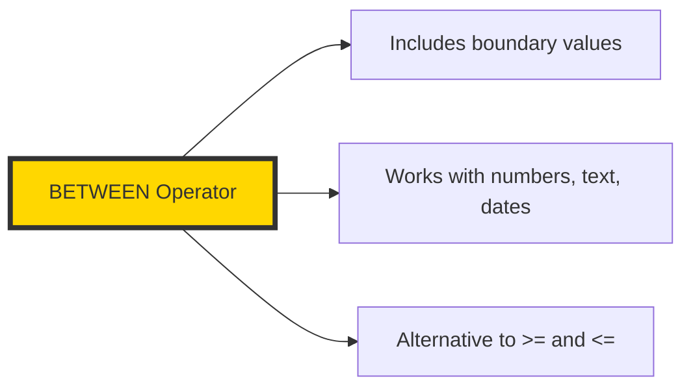

**Syntax:**
```sql
SELECT column1, column2
FROM table_name
WHERE column_name BETWEEN value1 AND value2;
```

**Examples:**
```sql
-- Employees with salary between 60000 and 80000
SELECT *
FROM Employee
WHERE Salary BETWEEN 60000 AND 80000;

-- Equivalent to:
SELECT *
FROM Employee
WHERE Salary >= 60000 AND Salary <= 80000;

-- NOT BETWEEN - employees with salary outside range
SELECT *
FROM Employee
WHERE Salary NOT BETWEEN 60000 AND 80000;

-- Between with text (alphabetical range)
SELECT *
FROM Employee
WHERE Name BETWEEN 'A' AND 'M';
```

---

### 3. LIKE Operator

The `LIKE` operator is used for pattern matching.

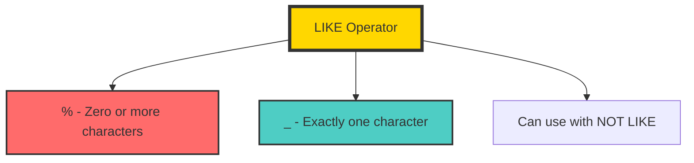

#### 3.1 Wildcard Characters

| Wildcard | Description | Example |
|----------|-------------|---------|
| `%` | Zero or more characters | `'%ri%'` contains "ri" |
| `_` | Exactly one character | `'_a_'` 3 characters, middle is "a" |
| `[ ]` | One character in set | `'[abc]%'` starts with a, b, or c |
| `[^]` | One character not in set | `'[^abc]%'` doesn't start with a, b, c |

#### 3.2 Pattern Matching Examples

```sql
-- Names starting with 'S'
SELECT *
FROM Employee
WHERE Name LIKE 'S%';
-- Result: Sai

-- Names ending with 'a'
SELECT *
FROM Employee
WHERE Name LIKE '%a';
-- Result: Priya, Kavya

-- Names containing 'ri'
SELECT *
FROM Employee
WHERE Name LIKE '%ri%';
-- Result: Priya

-- Names with exactly 4 characters
SELECT *
FROM Employee
WHERE Name LIKE '____';
-- Result: Sai (3 chars - not match), Rahul (5 chars - not match), Kavya (5 chars)

-- Names starting with 'S' and ending with 'i'
SELECT *
FROM Employee
WHERE Name LIKE 'S%i';
-- Result: Sai

-- Names where second letter is 'a'
SELECT *
FROM Employee
WHERE Name LIKE '_a%';
-- Result: Kavya, Rahul

-- Names containing 'ri' and ending with 'a'
SELECT *
FROM Employee
WHERE Name LIKE '%ri%a';
-- Result: Priya

-- NOT LIKE - names not containing 'ri'
SELECT *
FROM Employee
WHERE Name NOT LIKE '%ri%';
-- Result: Sai, Rahul, Kavya, Unni, Anmol
```

---

### 4. Pattern Matching Deep Dive

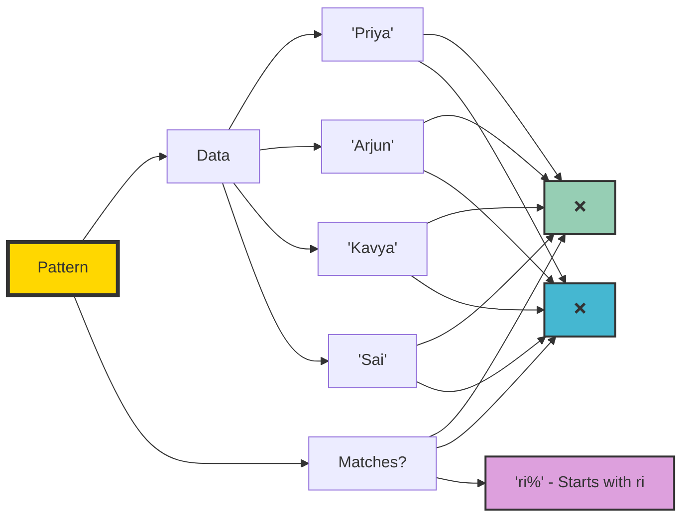

#### Pattern Comparison

| Pattern | Meaning | Matches | Doesn't Match |
|---------|---------|---------|---------------|
| `'%ri%'` | Contains "ri" anywhere | "Priya", "Arjun" | "Kavya", "Sai" |
| `'%ri'` | Ends with "ri" | "Arjun" | "Priya", "Kavya" |
| `'ri%'` | Starts with "ri" | No matches | All |
| `'_ri%'` | Second/third char is 'r', third/fourth is 'i' | "Priya" | Others |
| `'%ri%a'` | Contains "ri" and ends with "a" | "Priya" | Others |

---

### 5. IS NULL & IS NOT NULL

Used to check for NULL values.

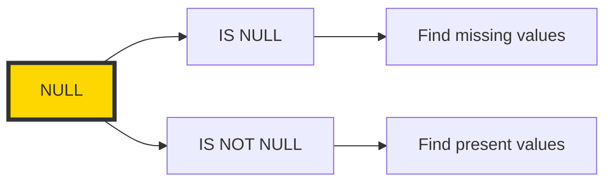

**Syntax:**
```sql
-- Find NULL values
SELECT *
FROM table_name
WHERE column_name IS NULL;

-- Find non-NULL values
SELECT *
FROM table_name
WHERE column_name IS NOT NULL;
```

**Example:**
```sql
-- Employees with missing location
SELECT *
FROM Employee
WHERE Location IS NULL;

-- Employees with valid location
SELECT *
FROM Employee
WHERE Location IS NOT NULL;

-- Important: NULL is not equal to anything
-- This won't work:
SELECT * FROM Employee WHERE Location = NULL;  -- ❌

-- This works:
SELECT * FROM Employee WHERE Location IS NULL;  -- ✅
```

---

### 6. Combined Operators Example

```sql
-- Complex query with IN, BETWEEN, LIKE, IS NULL
SELECT *
FROM Employee
WHERE Department IN ('AI', 'Java')
  AND Salary BETWEEN 50000 AND 70000
  AND Name LIKE 'S%'
  AND Location IS NOT NULL;

-- Order of operations
SELECT 
    Department,
    COUNT(*) as EmployeeCount,
    AVG(Salary) as AvgSalary
FROM Employee
WHERE Salary > 50000              -- Filter rows
  AND Department IN ('AI', 'Java') -- More filtering
  AND Location IS NOT NULL         -- NULL check
GROUP BY Department                -- Group
HAVING COUNT(*) > 1                -- Filter groups
ORDER BY AvgSalary DESC;           -- Sort
```

---

## 💡 The Complete Day 3 Assignment

### Java Assignment

**Problem Statement:**
Create a system with:
1. Abstract class `Employee` with abstract method `work()`
2. Interface `Login` with methods `login()` and `logout()`
3. Interface `Report` with method `generateReport()`
4. Class `Developer` extending `Employee` and implementing both interfaces
5. Demonstrate all methods in `main()`

**Complete Solution:**

```java
// Abstract class
abstract class Employee {
    private String name;
    private double salary;
    
    Employee(String name, double salary) {
        this.name = name;
        this.salary = salary;
    }
    
    public String getName() {
        return name;
    }
    
    public double getSalary() {
        return salary;
    }
    
    abstract void work();  // Abstract method
}

// Interface 1
interface Login {
    void login();
    void logout();
}

// Interface 2
interface Report {
    void generateReport();
}

// Concrete class extending abstract class and implementing interfaces
class Developer extends Employee implements Login, Report {
    private String programmingLanguage;
    
    Developer(String name, double salary, String programmingLanguage) {
        super(name, salary);
        this.programmingLanguage = programmingLanguage;
    }
    
    // From Employee abstract class
    @Override
    void work() {
        System.out.println(getName() + " is coding in " + programmingLanguage);
    }
    
    // From Login interface
    @Override
    public void login() {
        System.out.println(getName() + " logged in");
    }
    
    @Override
    public void logout() {
        System.out.println(getName() + " logged out");
    }
    
    // From Report interface
    @Override
    public void generateReport() {
        System.out.println(getName() + " generated report");
    }
}

// Main class
public class Day3Assignment {
    public static void main(String[] args) {
        Developer d = new Developer("Kavya", 75000, "Java");
        
        // Demonstrating all methods
        d.login();          // From Login interface
        d.work();           // From Employee abstract class
        d.generateReport(); // From Report interface
        
        // Polymorphism with abstract class
        Employee e = new Developer("Arjun", 80000, "Python");
        e.work();  // "Arjun is coding in Python"
        // e.login(); // ❌ ERROR: Employee reference doesn't have login()
        
        // Polymorphism with interface
        Login l = new Developer("Priya", 70000, "JavaScript");
        l.login();  // "Priya logged in"
        l.logout(); // "Priya logged out"
        // l.work(); // ❌ ERROR: Login reference doesn't have work()
        
        Report r = new Developer("Sai", 65000, "C++");
        r.generateReport(); // "Sai generated report"
        // r.login(); // ❌ ERROR: Report reference doesn't have login()
    }
}
```

**Output:**
```
Kavya logged in
Kavya is coding in Java
Kavya generated report
Arjun is coding in Python
Priya logged in
Priya logged out
Sai generated report
```

---

### SQL Assignment

**Questions:**

1. Find employees in AI or Data department
2. Find employees with salary between 60000 and 80000
3. Find employees whose name contains 'ri'
4. Find employees whose name starts with 'S'
5. Find employees whose name ends with 'a'
6. Find employees whose name contains 'ri' and ends with 'a'
7. Find employees in AI or Java department with salary > 60000
8. Find employees from Bangalore or Hyderabad with salary between 50000 and 70000
9. Find employees whose name doesn't start with 'S'
10. Find employees with valid Location (not NULL)

**Solutions:**

```sql
-- 1. Employees in AI or Data department
SELECT *
FROM Employee
WHERE Department IN ('AI', 'Data');

-- 2. Employees with salary between 60000 and 80000
SELECT *
FROM Employee
WHERE Salary BETWEEN 60000 AND 80000;

-- 3. Employees whose name contains 'ri'
SELECT *
FROM Employee
WHERE Name LIKE '%ri%';

-- 4. Employees whose name starts with 'S'
SELECT *
FROM Employee
WHERE Name LIKE 'S%';

-- 5. Employees whose name ends with 'a'
SELECT *
FROM Employee
WHERE Name LIKE '%a';

-- 6. Employees whose name contains 'ri' and ends with 'a'
SELECT *
FROM Employee
WHERE Name LIKE '%ri%a';

-- 7. Employees in AI or Java department with salary > 60000
SELECT *
FROM Employee
WHERE Department IN ('AI', 'Java')
  AND Salary > 60000;

-- 8. Employees from Bangalore or Hyderabad with salary between 50000 and 70000
SELECT *
FROM Employee
WHERE Location IN ('Bangalore', 'Hyderabad')
  AND Salary BETWEEN 50000 AND 70000;

-- 9. Employees whose name doesn't start with 'S'
SELECT *
FROM Employee
WHERE Name NOT LIKE 'S%';

-- 10. Employees with valid Location (not NULL)
SELECT *
FROM Employee
WHERE Location IS NOT NULL;
```

---

## ❌ Mistake Log - Day 3

### Java Mistakes

#### Mistake 1: Creating object of abstract class

**Incorrect:**
```java
Employee e = new Employee("Kavya", 75000);  // ❌ ERROR!
```

**Correct:**
```java
Employee e = new Developer("Kavya", 75000, "Java");  // ✅ Using concrete subclass
```

**Lesson:** Abstract classes cannot be instantiated - use concrete subclasses.

---

#### Mistake 2: Not implementing all abstract methods

**Incorrect:**
```java
abstract class Animal {
    abstract void sound();
    abstract void eat();
}

class Dog extends Animal {
    @Override
    void sound() {
        System.out.println("Bark");
    }
    // ❌ Missing eat() implementation
}
```

**Correct:**
```java
class Dog extends Animal {
    @Override
    void sound() {
        System.out.println("Bark");
    }
    
    @Override
    void eat() {
        System.out.println("Eats");
    }
}
```

**Lesson:** All abstract methods must be implemented.

---

#### Mistake 3: Wrong order of methods

**Incorrect:**
```java
Developer d = new Developer("Kavya");
d.work();       // Should be after login
d.login();
d.generateReport();
```

**Correct:**
```java
Developer d = new Developer("Kavya");
d.login();      // ✅ First
d.work();       // ✅ Second
d.generateReport(); // ✅ Third
```

**Lesson:** Follow the requested order even though it compiles either way.

---

### SQL Mistakes

#### Mistake 1: Wrong pattern for 'contains'

**Incorrect:**
```sql
WHERE Name LIKE '%ri'  -- Only finds names ending with 'ri'
```

**Correct:**
```sql
WHERE Name LIKE '%ri%'  -- Finds names containing 'ri' anywhere
```

**Lesson:** `%ri%` finds anywhere, `%ri` finds at the end.

---

#### Mistake 2: Using = for NULL

**Incorrect:**
```sql
WHERE Location = NULL  -- ❌ Always false
```

**Correct:**
```sql
WHERE Location IS NULL  -- ✅ Works
WHERE Location IS NOT NULL  -- ✅ Works
```

**Lesson:** NULL cannot be compared with =, use IS NULL or IS NOT NULL.

---

#### Mistake 3: Wrong operator order

**Incorrect:**
```sql
SELECT *
FROM Employee
WHERE Salary > 60000 AND Department = 'AI' OR Department = 'Java'
-- This might include Java employees regardless of salary!
```

**Correct:**
```sql
SELECT *
FROM Employee
WHERE Salary > 60000 AND (Department = 'AI' OR Department = 'Java')

-- OR better:
SELECT *
FROM Employee
WHERE Salary > 60000 AND Department IN ('AI', 'Java')
```

**Lesson:** Use parentheses for AND/OR combinations or use IN operator.

---

## 📊 Progress Tracker

| Concept | Status | Confidence |
|---------|--------|------------|
| Abstract Classes | ✅ Locked | ⭐⭐⭐⭐ |
| Abstract Methods | ✅ Locked | ⭐⭐⭐⭐ |
| Interfaces | ✅ Locked | ⭐⭐⭐⭐ |
| Multiple Inheritance | ✅ Locked | ⭐⭐⭐⭐ |
| Abstract vs Interface | ✅ Locked | ⭐⭐⭐⭐ |
| IN Operator | ✅ Locked | ⭐⭐⭐⭐⭐ |
| BETWEEN Operator | ✅ Locked | ⭐⭐⭐⭐⭐ |
| LIKE Operator | ✅ Locked | ⭐⭐⭐⭐⭐ |
| Pattern Matching | ✅ Locked | ⭐⭐⭐⭐⭐ |
| IS NULL | ✅ Locked | ⭐⭐⭐⭐⭐ |

---

## 🎯 Quick Reference Cards

### Java Quick Reference

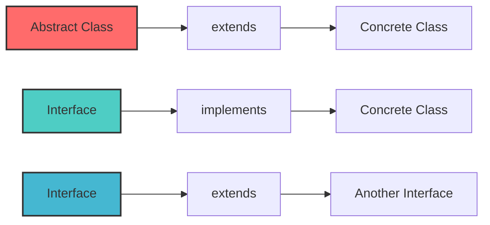

### SQL Pattern Reference

| Pattern | Meaning | Example |
|---------|---------|---------|
| `'%ri%'` | Contains 'ri' | "Priya", "Arjun" |
| `'%ri'` | Ends with 'ri' | "Arjun" |
| `'ri%'` | Starts with 'ri' | None |
| `'%ri%a'` | Contains 'ri' and ends with 'a' | "Priya" |

---

## 📝 Day 3 Summary

### ☕ Java Concepts Mastered

- ✅ **Abstract classes** - Cannot be instantiated, serve as templates
- ✅ **Abstract methods** - No body, must be overridden
- ✅ **Interfaces** - Define contracts, support multiple inheritance
- ✅ **Multiple inheritance** - Supported through interfaces
- ✅ **Abstract vs Interface** - Key differences understood

### 🗄️ SQL Concepts Mastered

- ✅ **IN operator** - Multiple values in WHERE
- ✅ **BETWEEN operator** - Range checking
- ✅ **LIKE operator** - Pattern matching
- ✅ **Pattern matching** - `%` and `_` wildcards
- ✅ **IS NULL** - NULL value checking

### 🎯 Key Takeaways

1. **Abstract classes** can't be instantiated
2. **Interfaces** define a contract
3. **Multiple inheritance** is only through interfaces
4. `%ri%` finds anywhere, `%ri` finds at end
5. NULL requires IS NULL, not =

---

## 🏆 Day 3 Score

### Java: **8/10**
### SQL: **9/10**
### Combined: **8.5/10** 🎉

---

## ✅ Day 3 Checklist

- [x] Abstract classes understood
- [x] Abstract methods implemented
- [x] Interfaces created and used
- [x] Multiple inheritance with interfaces
- [x] IN operator practiced
- [x] BETWEEN operator practiced
- [x] LIKE operator practiced
- [x] Pattern matching understood
- [x] IS NULL & IS NOT NULL used
- [x] Mistakes documented
- [x] Pushed to GitHub

---

## 🚀 What's Next - Day 4 Preview

### ☕ Java Day 4
- Exception Handling basics
- `try`, `catch`, `finally`
- `throw`, `throws`
- Common exceptions
- Error handling in code

### 🗄️ SQL Day 4
- `UPDATE` - Modify existing data
- `DELETE` - Remove rows
- `ALTER` - Modify table structure
- `TRUNCATE` - Remove all rows
- `DROP` - Remove entire table
- Data modification vs structure modification

---

<p align="center">
  <b>✨ Day 3 is now LOCKED! ✨</b>
</p>

<p align="center">
  <i>"A correction learned is a lesson earned!"</i>
</p>

---

*Made with 💖 and ☕ during Infosys Preparation Journey*
*Day 3 - JULY 2026*
