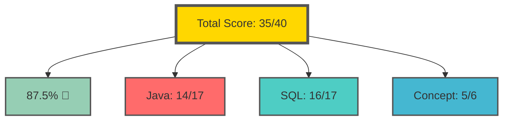
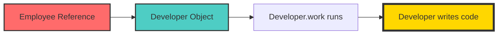
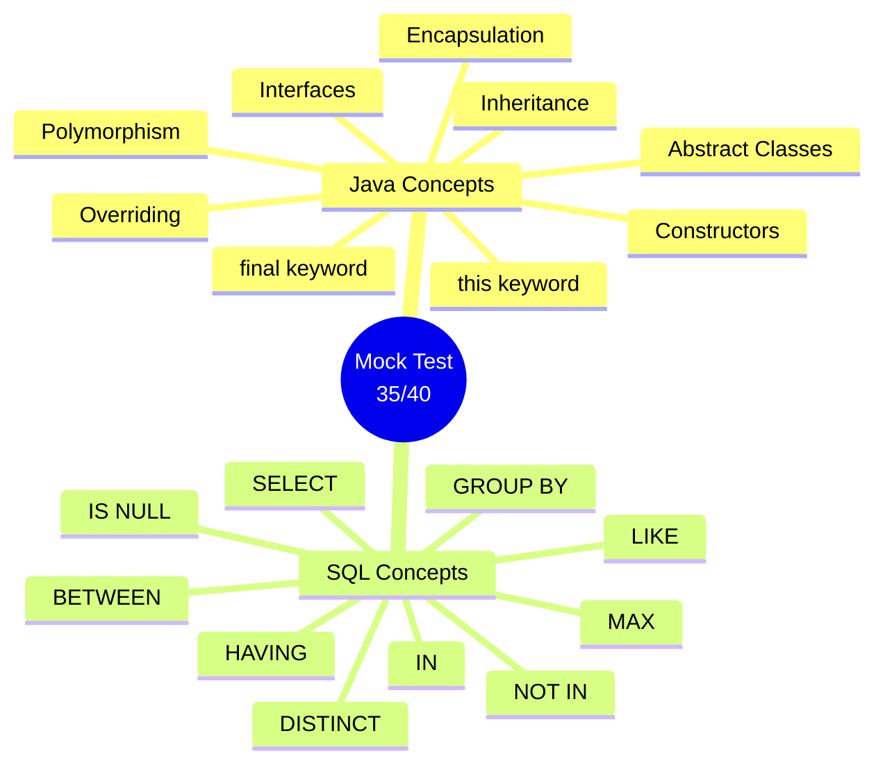

# ✨ Sunday Revision Mock - Days 1 to 3 ✨

> *"The difference between knowing and mastering is tested, not taught!"*

[](https://www.java.com/)
[](https://www.oracle.com/java/technologies/)
[](https://www.mysql.com/)
[]()

---

## 🎯 Today's Mission

> *"No notes, no shortcuts - just pure knowledge!"*

**Date:** 06-07-2026  
**Focus:** Revision of Days 1-3  
**Topics Covered:**
- OOP Basics, Constructors, `this`, Encapsulation
- Inheritance, Overriding, Polymorphism
- Abstract Classes, Interfaces, `final`
- SQL Basics, Aggregate Functions
- `GROUP BY`, `HAVING`
- `IN`, `BETWEEN`, `LIKE`, `NULL`

---

## 📊 Score Summary



---

# SECTION A - JAVA / OOP MCQs 🎯

## Q1. What is the main purpose of a constructor in Java?

**Options:**
- A. To destroy objects
- B. To initialize object state when an object is created ✅
- C. To inherit parent class members
- D. To hide variables from other classes

<details>
<summary><b>💡 Explanation</b></summary>

A constructor is a special method that initializes the object's state when it's created. It sets up the initial values of instance variables and performs any startup operations needed for the object to function correctly.

```java
class Student {
    String name;
    int rollNo;
    
    // Constructor initializes the object
    Student(String name, int rollNo) {
        this.name = name;
        this.rollNo = rollNo;
    }
}
```
</details>

---

## Q2. What does `this.name = name;` mean inside a constructor?

**Options:**
- A. Assign local variable to itself
- B. Assign instance variable `name` with constructor parameter `name` ✅
- C. Create a new object called `name`
- D. Call the constructor again

<details>
<summary><b>💡 Explanation</b></summary>

`this` refers to the current object. `this.name` is the instance variable of the current object, while `name` is the constructor parameter. This distinction is crucial when they have the same name.

```java
class Student {
    String name;
    
    Student(String name) {
        this.name = name;  // this.name = instance variable, name = parameter
    }
}
```
</details>

---

## Q3. Which of the following best represents encapsulation?

**Options:**
- A. Creating many objects of a class
- B. Hiding data using `private` and allowing controlled access through methods ✅
- C. Writing multiple classes in one file
- D. Using inheritance to reuse code

<details>
<summary><b>💡 Explanation</b></summary>

Encapsulation bundles data and methods together while hiding internal details. It's like a capsule that protects the data inside.

```java
class BankAccount {
    private double balance;  // Data hidden
    
    public void deposit(double amount) {  // Controlled access
        if (amount > 0) balance += amount;
    }
    
    public double getBalance() {
        return balance;
    }
}
```
</details>

---

## Q4. What is printed when `Employee e = new Developer(); e.work();` runs?

**Options:**
- A. Employee works
- B. Developer writes code ✅
- C. Compile-time error
- D. Nothing

<details>
<summary><b>💡 Explanation</b></summary>

Method overriding + runtime polymorphism. Even though the reference is `Employee`, the actual object is `Developer`, so `Developer.work()` runs.


</details>

---

## Q5. Why was `e.showBothWorks()` invalid in Day 2?

**Options:**
- A. Because overridden methods cannot be called using parent reference
- B. Because child class methods are never accessible
- C. Because compiler checks method availability using the reference type ✅
- D. Because `Developer` cannot extend `Employee`

<details>
<summary><b>💡 Explanation</b></summary>

Compiler checks what methods are available using the reference type (Employee). Since `showBothWorks()` doesn't exist in Employee, it's a compilation error.

```java
Employee e = new Developer("Kavya");
e.showBothWorks();  // ❌ COMPILATION ERROR
// Reference type: Employee
// Employee doesn't have showBothWorks()
```
</details>

---

## Q6. What does `super(name);` do inside a child constructor?

**Options:**
- A. Calls the child constructor again
- B. Calls the parent class constructor with `name` ✅
- C. Calls a static method from parent
- D. Creates a new parent object separately

<details>
<summary><b>💡 Explanation</b></summary>

`super(name)` explicitly calls the parent class constructor with the parameter `name`. This ensures the parent portion of the object is properly initialized.

```java
class Employee {
    Employee(String name) {
        System.out.println("Employee: " + name);
    }
}

class Developer extends Employee {
    Developer(String name) {
        super(name);  // Calls Employee(name) constructor
    }
}
```
</details>

---

## Q7. Which statement about `final` is correct?

**Options:**
- A. A `final` class can be inherited
- B. A `final` method cannot be overridden ✅
- C. A `final` variable must always be public
- D. A `final` method cannot be called

<details>
<summary><b>💡 Explanation</b></summary>

`final` has three uses:
- `final variable`: value cannot change
- `final method`: cannot be overridden
- `final class`: cannot be inherited

```java
class Parent {
    final void show() {
        System.out.println("Cannot override this");
    }
}

class Child extends Parent {
    // void show() { } // ❌ ERROR! Cannot override
}
```
</details>

---

## Q8. Which is true about an abstract class?

**Options:**
- A. It must contain only abstract methods
- B. Its objects can always be created directly
- C. It can contain both abstract and concrete methods ✅
- D. It cannot have constructors

<details>
<summary><b>💡 Explanation</b></summary>

Abstract classes can have a mix of abstract and concrete methods. They're like incomplete blueprints - they can have some things already built and others that need to be completed by subclasses.

```java
abstract class Employee {
    abstract void work();     // Abstract - must be implemented
    
    void login() {            // Concrete - already implemented
        System.out.println("Logged in");
    }
}
```
</details>

---

## Q9. Which keyword is used when a class takes behavior from an interface?

**Options:**
- A. extends
- B. implements ✅
- C. inherit
- D. super

<details>
<summary><b>💡 Explanation</b></summary>

- `extends`: used to inherit a class
- `implements`: used to implement an interface
- A class can implement multiple interfaces

```java
interface Printable {
    void print();
}

class Report implements Printable {
    public void print() {
        System.out.println("Report printed");
    }
}
```
</details>

---

## Q10. Why can't we create objects of an abstract class directly?

**Options:**
- A. Because constructors cannot take strings
- B. Because abstract classes cannot have constructors
- C. Because objects of abstract classes cannot be created directly ✅
- D. Because `Employee` must be final

<details>
<summary><b>💡 Explanation</b></summary>

Abstract classes are incomplete (they have abstract methods without bodies). Creating an object of an abstract class would mean having an object with missing method implementations - which doesn't make sense.

```java
abstract class Animal {
    abstract void sound();
}

// Animal a = new Animal(); // ❌ ERROR!
// The object would be incomplete
```
</details>

---

# SECTION B - OUTPUT/ERROR BASED 🔍

## Q11. What is the output?

```java
class A {
    void show() {
        System.out.println("A");
    }
}

class B extends A {
    void show() {
        System.out.println("B");
    }
}

public class Main {
    public static void main(String[] args) {
        A obj = new B();
        obj.show();
    }
}
```

**Answer:**
```text
B
```

**Reason:** Runtime polymorphism! Reference is A, but object is B. Since `show()` is overridden, B's version runs.

---

## Q12. What is the output/error?

```java
abstract class Animal {
    abstract void sound();
}

class Dog extends Animal {
    void sound() {
        System.out.println("Bark");
    }
}

public class Main {
    public static void main(String[] args) {
        Animal a = new Animal();
        a.sound();
    }
}
```

**Answer:**
```
Compile-time error
```

**Reason:** Cannot instantiate abstract class `Animal`.

---

## Q13. What is the output?

```java
class Parent {
    void display() {
        System.out.println("Parent");
    }
}

class Child extends Parent {
    void display() {
        System.out.println("Child");
    }
    
    void show() {
        super.display();
        display();
    }
}

public class Main {
    public static void main(String[] args) {
        Child c = new Child();
        c.show();
    }
}
```

**Answer:**
```text
Parent
Child
```

**Reason:** `super.display()` calls parent version, `display()` calls child overridden version.

---

## Q14. What happens when `final` method is overridden?

```java
class Test {
    final void show() {
        System.out.println("Hello");
    }
}

class Demo extends Test {
    void show() {
        System.out.println("Hi");
    }
}
```

**Answer:**
```
Compile-time error
```

**Reason:** `final` methods cannot be overridden.

---

## Q15. What is the output?

```java
interface Printable {
    void print();
}

class Report implements Printable {
    public void print() {
        System.out.println("Report printed");
    }
}

public class Main {
    public static void main(String[] args) {
        Printable p = new Report();
        p.print();
    }
}
```

**Answer:**
```text
Report printed
```

**Reason:** Interface reference pointing to implementing class object.

---

# SECTION C - SQL MCQs 🗄️

## Q16. Which query returns all columns from Employee table?

**Options:**
- A. `SELECT Employee;`
- B. `SELECT * FROM Employee;` ✅
- C. `GET * FROM Employee;`
- D. `SHOW Employee;`

<details>
<summary><b>💡 Explanation</b></summary>

`SELECT *` means "select all columns". The full syntax is `SELECT * FROM table_name;`.

```sql
SELECT * FROM Employee;
```
</details>

---

## Q17. Which clause removes duplicate values?

**Options:**
- A. ORDER BY
- B. DISTINCT ✅
- C. GROUP BY
- D. UNIQUE BY

<details>
<summary><b>💡 Explanation</b></summary>

`DISTINCT` removes duplicate rows from the result set.

```sql
SELECT DISTINCT Department FROM Employee;
-- Returns unique departments only
```
</details>

---

## Q18. Which query gives the highest salary?

**Options:**
- A. `SELECT HIGH(Salary) FROM Employee;`
- B. `SELECT MAX(Salary) FROM Employee;` ✅
- C. `SELECT TOP(Salary) FROM Employee;`
- D. `SELECT BIGGEST(Salary) FROM Employee;`

<details>
<summary><b>💡 Explanation</b></summary>

`MAX()` is the aggregate function for finding the maximum value.

```sql
SELECT MAX(Salary) FROM Employee;
-- Returns the highest salary
```
</details>

---

## Q19. Which clause groups rows for aggregate calculation?

**Options:**
- A. ORDER BY
- B. HAVING
- C. GROUP BY ✅
- D. DISTINCT

<details>
<summary><b>💡 Explanation</b></summary>

`GROUP BY` groups rows with the same values. Often used with aggregate functions.

```sql
SELECT Department, AVG(Salary)
FROM Employee
GROUP BY Department;
-- Groups employees by department
```
</details>

---

## Q20. Which clause filters grouped results?

**Options:**
- A. WHERE
- B. HAVING ✅
- C. ORDER BY
- D. DISTINCT

<details>
<summary><b>💡 Explanation</b></summary>

`HAVING` filters groups after `GROUP BY`. It's like `WHERE` but for groups.

```sql
SELECT Department, AVG(Salary)
FROM Employee
GROUP BY Department
HAVING AVG(Salary) > 60000;
-- Only shows departments with avg salary > 60000
```
</details>

---

## Q21. Which query selects employees from AI or Java department?

**Options:**
- A. `WHERE Department = 'AI' AND 'Java';`
- B. `WHERE Department IN ('AI', 'Java');` ✅
- C. `WHERE Department BETWEEN 'AI' AND 'Java';`
- D. `WHERE Department LIKE 'AI,Java';`

<details>
<summary><b>💡 Explanation</b></summary>

`IN` operator checks if a value matches any value in a list.

```sql
SELECT *
FROM Employee
WHERE Department IN ('AI', 'Java');
```
</details>

---

## Q22. What does `BETWEEN 55000 AND 70000` mean?

**Options:**
- A. salary > 55000 and < 70000 only
- B. salary >= 55000 and <= 70000 ✅
- C. salary = 55000 only
- D. invalid syntax

<details>
<summary><b>💡 Explanation</b></summary>

`BETWEEN` includes both boundaries.

```sql
SELECT * FROM Employee
WHERE Salary BETWEEN 55000 AND 70000;
-- Same as: Salary >= 55000 AND Salary <= 70000
```
</details>

---

## Q23. Which query checks missing ManagerID?

**Options:**
- A. `WHERE ManagerID = NULL`
- B. `WHERE ManagerID == NULL`
- C. `WHERE ManagerID IS NULL` ✅
- D. `WHERE ManagerID LIKE NULL`

<details>
<summary><b>💡 Explanation</b></summary>

NULL cannot be compared with `=` or `==`. Use `IS NULL` or `IS NOT NULL`.

```sql
SELECT * FROM Employee
WHERE ManagerID IS NULL;
-- Finds employees with no manager
```
</details>

---

## Q24. Which pattern finds names containing `ri` anywhere?

**Options:**
- A. `LIKE 'ri%'`
- B. `LIKE '%ri'`
- C. `LIKE '%ri%'` ✅
- D. `LIKE '_ri'`

<details>
<summary><b>💡 Explanation</b></summary>

- `'ri%'` - starts with "ri"
- `'%ri'` - ends with "ri"
- `'%ri%'` - contains "ri" anywhere
- `'_ri'` - first char any, then "ri"

```sql
SELECT * FROM Employee
WHERE Name LIKE '%ri%';
-- Matches: Priya, Arjun, etc.
```
</details>

---

## Q25. Which query excludes AI and Java departments?

**Options:**
- A. `WHERE Department NOT IN ('AI', 'Java')` ✅
- B. `WHERE Department != ('AI', 'Java')`
- C. `WHERE Department IS NOT ('AI', 'Java')`
- D. `WHERE Department OUT ('AI', 'Java')`

<details>
<summary><b>💡 Explanation</b></summary>

`NOT IN` excludes values from the list.

```sql
SELECT * FROM Employee
WHERE Department NOT IN ('AI', 'Java');
-- Excludes AI and Java departments
```
</details>

---

# SECTION D - SQL WRITING 📝

## Q26. Show only Name and Salary

```sql
SELECT Name, Salary
FROM Employee;
```

---

## Q27. Show employees with salary > 60000

```sql
SELECT *
FROM Employee
WHERE Salary > 60000;
```

---

## Q28. Show distinct departments

```sql
SELECT DISTINCT Department
FROM Employee;
```

---

## Q29. Show department-wise total salary

```sql
SELECT Department, SUM(Salary) as TotalSalary
FROM Employee
GROUP BY Department;
```

---

## Q30. Show departments with total salary > 100000

```sql
SELECT Department, SUM(Salary) as TotalSalary
FROM Employee
GROUP BY Department
HAVING SUM(Salary) > 100000;
```

---

## Q31. Show employees whose names start with `S`

```sql
SELECT *
FROM Employee
WHERE Name LIKE 'S%';
```

---

## Q32. Show employees whose names contain `ri`

```sql
SELECT *
FROM Employee
WHERE Name LIKE '%ri%';
```

---

## Q33. Show employees with non-null ManagerID

```sql
SELECT *
FROM Employee
WHERE ManagerID IS NOT NULL;
```

---

# SECTION E - SHORT JAVA WRITING 💻

## Q34. Write BankAccount class

```java
class BankAccount {
    private String ownerName;
    private double balance;
    
    BankAccount(String ownerName, double balance) {
        this.ownerName = ownerName;
        this.balance = balance;
    }
    
    public void deposit(double amount) {
        if (amount > 0) {
            balance += amount;
        }
    }
    
    public double getBalance() {
        return balance;
    }
}
```

---

## Q35. Write Abstract Employee + Tester

```java
abstract class Employee {
    String name;
    
    Employee(String name) {
        this.name = name;
    }
    
    abstract void work();
}

class Tester extends Employee {
    Tester(String name) {
        super(name);
    }
    
    @Override
    void work() {
        System.out.println("Tester tests software");
    }
}
```

---

# SECTION F - RAPID FIRE 🔥

## Q36. Constructor vs Method

### Constructor
- Initializes object state
- Called automatically on object creation
- Same name as class
- No return type

### Method
- Defines behavior/action
- Called explicitly
- Any valid name
- Can return values

---

## Q37. Overriding vs Overloading

### Overriding
- Child provides new implementation of parent method
- Same method name + parameters
- Requires inheritance
- Runtime polymorphism

### Overloading
- Same name, different parameters
- Same class or inherited context
- Compile-time polymorphism

---

## Q38. WHERE vs HAVING

### WHERE
- Filters rows BEFORE grouping
- Cannot use aggregate functions

### HAVING
- Filters groups AFTER grouping
- Can use aggregate functions

---

## Q39. `LIKE '%a'` vs `LIKE 'a%'`

### `LIKE '%a'`
- Ends with 'a'
- Examples: "Sita", "Kavya"

### `LIKE 'a%'`
- Starts with 'a'
- Examples: "Arjun", "Asha"

---

## Q40. Why use interfaces?

**Answer:** To define a contract/capability that multiple classes can implement.

```java
interface Printable {
    void print();
}

// Any class implementing this must provide print()
// Supports abstraction, loose coupling, multiple inheritance of type
```

---

## 🎨 Visual Summary



---

## ❌ Mistake Log - What I Learned

### Mistake 1: Wrong MCQ Option
- **Issue:** Marked wrong option for `final` despite knowing the concept
- **Lesson:** Careful marking is essential - concept knowledge isn't enough

### Mistake 2: Abstract Class Instantiation
- **Issue:** Almost thought `Animal a = new Animal();` was valid
- **Lesson:** Abstract classes CANNOT be instantiated directly

### Mistake 3: SQL LIKE Syntax
- **Issue:** Initially wrote `SELECT * FROM Employee LIKE 'S%';`
- **Correct:** `SELECT * FROM Employee WHERE Name LIKE 'S%';`

### Mistake 4: Missing super() Call
- **Issue:** Forgot to call `super(name)` in Tester constructor
- **Lesson:** If parent has parameterized constructor, child must call it

---

## 🏆 Key Takeaways

### The Golden Rules

1. **Constructor** initializes object state
2. **this** refers to current object
3. **Encapsulation** hides data, provides controlled access
4. **Overriding** requires inheritance, same signature
5. **Polymorphism** - reference type determines what can be called, object type determines what runs
6. **Abstract class** - cannot be instantiated, can have abstract + concrete methods
7. **Interface** - defines contract, supports multiple inheritance
8. **final** - variable (value fixed), method (can't override), class (can't inherit)
9. **WHERE** vs **HAVING** - before group vs after group
10. **NULL** requires `IS NULL` or `IS NOT NULL`

---

## 📊 Section-wise Performance

| Section | Score | Status |
|---------|-------|--------|
| Java MCQs | 9/10 | ⭐⭐⭐⭐ |
| Output/Error | 4/5 | ⭐⭐⭐⭐ |
| SQL MCQs | 10/10 | ⭐⭐⭐⭐⭐ |
| SQL Writing | 6/8 | ⭐⭐⭐⭐ |
| Java Writing | 1/2 | ⭐⭐⭐ |
| Rapid Fire | 5/5 | ⭐⭐⭐⭐⭐ |

---

## 🎯 Next Steps

### Day 4 Preview
- Exception Handling: `try`, `catch`, `finally`
- `throw` vs `throws`
- Checked vs Unchecked exceptions
- Custom exceptions

### SQL Day 4 Preview
- `UPDATE` - Modify data
- `DELETE` - Remove rows
- `ALTER` - Modify structure
- `TRUNCATE` - Remove all rows
- `DROP` - Remove entire table

---

<p align="center">
  <b>✨ Mock Test Complete! Great Job! ✨</b>
</p>

<p align="center">
  <i>"What gets measured gets improved!"</i>
</p>

---

*Made with 💖 and ☕ during Infosys Preparation Journey*
*Sunday Revision Mock - 06-07-2026*
