# ✨ Day 5 - Exception Handling & SQL Data Modification ✨

> *"Errors are not failures - they're opportunities to handle gracefully!"*

[](https://www.java.com/)
[](https://www.oracle.com/java/technologies/)
[](https://www.mysql.com/)
[](https://www.mysql.com/)

---

## 📊 Day 5 Score Card

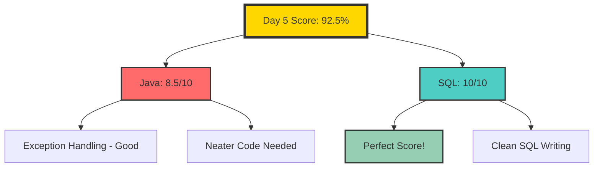

---

## 📚 Table of Contents

1. [Java Exception Handling](#-java-exception-handling)
   - [What are Exceptions?](#1-what-is-an-exception)
   - [try-catch-finally](#4-try-and-catch)
   - [Multiple Catch Blocks](#9-multiple-catch-blocks)
   - [throw vs throws](#14-throws-keyword)
   - [Checked vs Unchecked](#12-checked-vs-unchecked-exceptions)
   - [Common Exceptions](#11-common-built-in-exceptions-you-must-know)
2. [SQL Data Modification](#-sql-data-modification)
   - [UPDATE](#1-update)
   - [DELETE](#4-delete)
   - [TRUNCATE](#6-truncate)
   - [ALTER](#8-alter)
   - [DROP](#9-drop)
   - [Key Differences](#10-difference-delete-vs-truncate-vs-drop)
3. [Practice Assignments](#-day-4-assignment)
4. [Mistake Log](#-mistake-log)
5. [Summary](#-summary)

---

# ☕ Java Exception Handling

## 1. What is an Exception?

An **exception** is an **abnormal event / runtime problem** that interrupts the normal flow of a program.

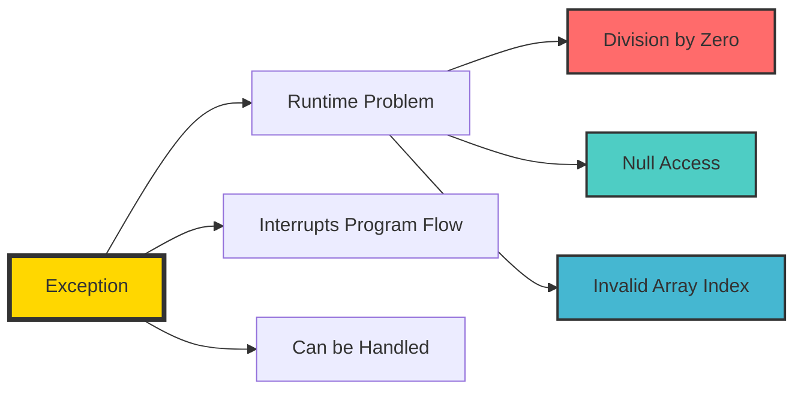

### Simple Examples:
- Dividing by zero
- Accessing an invalid array index
- Reading a file that doesn't exist
- Converting `"abc"` to integer
- Calling a method on a `null` reference

---

## 2. Why Do We Need Exception Handling?

Without exception handling, if a risky statement fails, the program may **terminate abruptly**.

### ❌ Example Without Handling:

```java
public class Main {
    public static void main(String[] args) {
        int a = 10;
        int b = 0;
        int c = a / b;   // risky
        System.out.println(c);
        System.out.println("Program ended");
    }
}
```

### What Happens:
- `a / b` causes **ArithmeticException**
- Program stops immediately
- `"Program ended"` is **not printed**

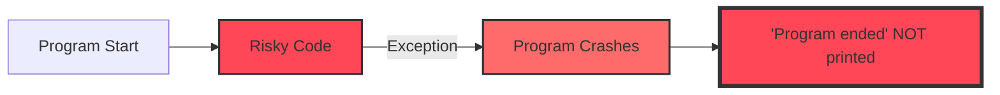

---

## 3. What is Exception Handling?

Exception handling means writing code so that **even if an error occurs, the program handles it gracefully instead of crashing blindly**.

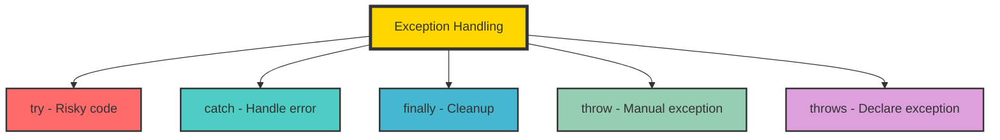

---

## 4. try and catch

### Syntax:
```java
try {
    // risky code
} catch (ExceptionType e) {
    // handling code
}
```

### ✅ Example 1 — Divide by Zero:

```java
public class Main {
    public static void main(String[] args) {
        try {
            int result = 10 / 0;
            System.out.println(result);
        } catch (ArithmeticException e) {
            System.out.println("Cannot divide by zero");
        }
        
        System.out.println("Program continues");
    }
}
```

### Output:
```text
Cannot divide by zero
Program continues
```

### Flow of Execution:

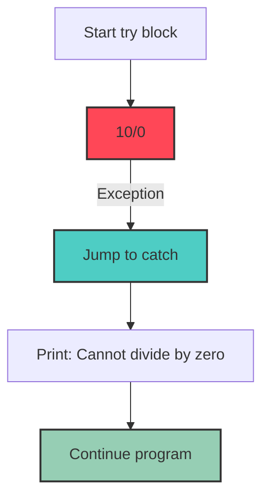

---

## 5. Important Rule About try

A `try` block **cannot exist alone**. It must be followed by at least one of:
- `catch`
- `finally`

### ✅ Valid:
```java
try { ... } catch (...) { ... }
try { ... } finally { ... }
try { ... } catch (...) { ... } finally { ... }
```

### ❌ Invalid:
```java
try {
    // code
}  // ERROR! try without catch or finally
```

---

## 6. finally Block

`finally` contains code that **always runs**, whether exception occurs or not.

### Typical Use:
- Closing files
- Closing DB connection
- Cleanup code

### ✅ Example 2:
```java
public class Main {
    public static void main(String[] args) {
        try {
            int x = 10 / 0;
        } catch (ArithmeticException e) {
            System.out.println("Exception handled");
        } finally {
            System.out.println("Finally block executed");
        }
    }
}
```

### Output:
```text
Exception handled
Finally block executed
```

### ✅ Example 3 — No Exception Case:
```java
public class Main {
    public static void main(String[] args) {
        try {
            int x = 10 / 2;
            System.out.println(x);
        } catch (ArithmeticException e) {
            System.out.println("Exception handled");
        } finally {
            System.out.println("Finally block executed");
        }
    }
}
```

### Output:
```text
5
Finally block executed
```

### finally Runs in BOTH Cases:

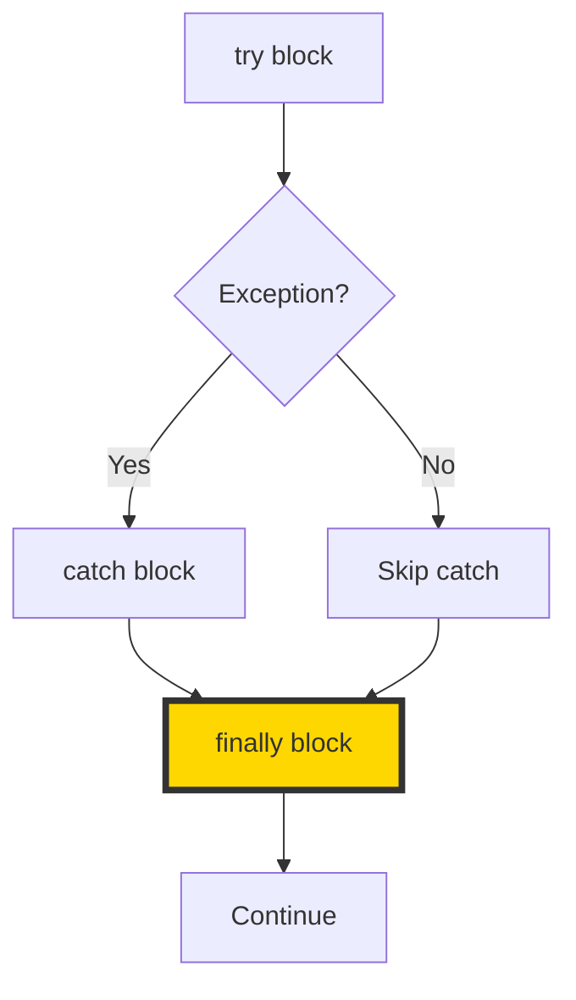

---

## 7. Cases of try-catch-finally Flow

### **Case A: No Exception**
- `try` runs fully
- `catch` skipped
- `finally` runs

### **Case B: Exception Occurs and Matching Catch Exists**
- `try` runs until exception line
- Remaining `try` lines skipped
- Matching `catch` runs
- `finally` runs

### **Case C: Exception Occurs but No Matching Catch**
- `try` stops
- No suitable catch
- `finally` still runs
- Program terminates with exception

---

## 8. Code After Exception Line Inside try is Skipped

### Example:
```java
public class Main {
    public static void main(String[] args) {
        try {
            System.out.println("A");
            int x = 10 / 0;
            System.out.println("B");
        } catch (ArithmeticException e) {
            System.out.println("C");
        }
        System.out.println("D");
    }
}
```

### Output:
```text
A
C
D
```

### Why Not B?
Once exception happens at `10 / 0`, control leaves `try` immediately.

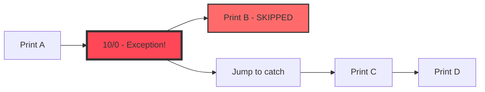

---

## 9. Multiple Catch Blocks

A `try` can have multiple catches for different exception types.

### Example:
```java
public class Main {
    public static void main(String[] args) {
        try {
            String s = null;
            System.out.println(s.length());
        } catch (ArithmeticException e) {
            System.out.println("Arithmetic problem");
        } catch (NullPointerException e) {
            System.out.println("Null problem");
        } catch (Exception e) {
            System.out.println("Some other exception");
        }
    }
}
```

### Output:
```text
Null problem
```

---

## 10. Order of catch Blocks Matters ⚠️

### ❌ Wrong:
```java
try {
    int x = 10 / 0;
} catch (Exception e) {
    System.out.println("General");
} catch (ArithmeticException e) {
    System.out.println("Arithmetic");
}
```

### Why Wrong?
`Exception` is parent of `ArithmeticException`. If general parent catch comes first, the child catch becomes unreachable.

### Result: **Compile-time error: unreachable catch block**

### ✅ Correct Order:
```java
try {
    int x = 10 / 0;
} catch (ArithmeticException e) {
    System.out.println("Arithmetic");
} catch (Exception e) {
    System.out.println("General");
}
```

### Rule: **Specific catch first, general catch later**

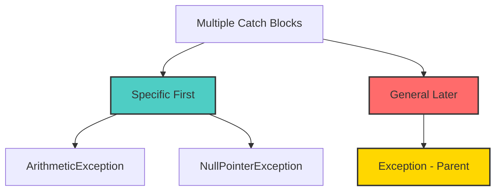

---

## 11. Common Built-in Exceptions You Must Know

### 1. ArithmeticException
Raised for arithmetic errors like division by zero.

```java
int x = 10 / 0;
```

### 2. NullPointerException
Raised when you try to access method/field using `null` reference.

```java
String s = null;
System.out.println(s.length());
```

### 3. ArrayIndexOutOfBoundsException
Raised when array index is outside valid range.

```java
int[] arr = {1, 2, 3};
System.out.println(arr[5]);
```

### 4. NumberFormatException
Raised when invalid string is converted to number.

```java
int x = Integer.parseInt("abc");
```

### 5. StringIndexOutOfBoundsException
Raised when invalid string index is used.

```java
String s = "Java";
System.out.println(s.charAt(10));
```

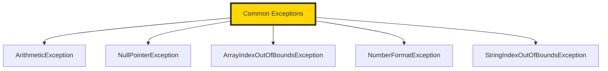

---

## 12. Checked vs Unchecked Exceptions

### Unchecked Exceptions
- Occur at runtime
- Compiler does **not** force you to handle them
- Subclasses of **RuntimeException**
- Examples: `ArithmeticException`, `NullPointerException`, `ArrayIndexOutOfBoundsException`, `NumberFormatException`

```java
int x = 10 / 0;  // Compiler allows it, exception comes at runtime
```

### Checked Exceptions
- Compiler **forces** you to handle or declare them
- Examples: `IOException`, `FileNotFoundException`, `SQLException`

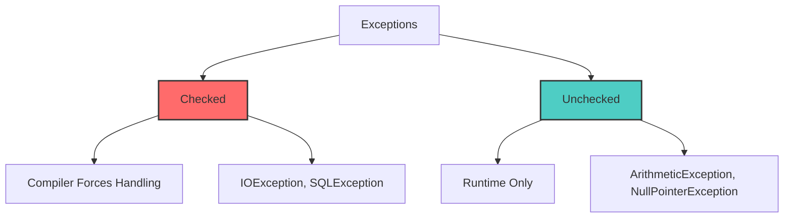

---

## 13. throw Keyword

`throw` is used to **manually throw an exception**.

### Syntax:
```java
throw new ExceptionType("message");
```

### Example:
```java
public class Main {
    public static void main(String[] args) {
        int age = 15;
        
        if (age < 18) {
            throw new ArithmeticException("Not eligible");
        }
        
        System.out.println("Eligible");
    }
}
```

---

## 14. throws Keyword

`throws` is used in **method declaration** to indicate that the method may pass an exception to the caller.

### Syntax:
```java
void myMethod() throws IOException {
    // code
}
```

---

## 15. throw vs throws

This gets asked a lot!

| `throw` | `throws` |
|---------|----------|
| Used **inside method body** | Used in **method declaration** |
| Manual throw of **one exception object** | Tells that method may pass exception to caller |
| Followed by `new ExceptionType(...)` | Can declare one or more exception types |

### Example:
```java
// throw - inside method
throw new ArithmeticException("Invalid");

// throws - in method signature
void readFile() throws IOException {
}
```

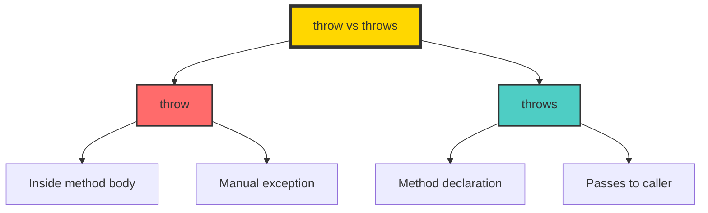

---

## 16. Custom Exception Basics

You can create your own exception class.

```java
class InvalidAgeException extends Exception {
    InvalidAgeException(String message) {
        super(message);
    }
}
```

### Then Use:
```java
throw new InvalidAgeException("Age must be 18 or above");
```

### Real-Life Examples:
- `InvalidMarksException`
- `InsufficientBalanceException`
- `InvalidEmployeeIdException`

---

## 17. Infosys-Style Output Traps

### Trap 1:
```java
public class Main {
    public static void main(String[] args) {
        try {
            System.out.println("A");
            int x = 10 / 0;
            System.out.println("B");
        } catch (ArithmeticException e) {
            System.out.println("C");
        } finally {
            System.out.println("D");
        }
        System.out.println("E");
    }
}
```

### Output:
```text
A
C
D
E
```

### Trap 2:
```java
public class Main {
    public static void main(String[] args) {
        try {
            System.out.println("A");
            int[] arr = {1,2,3};
            System.out.println(arr[5]);
            System.out.println("B");
        } catch (ArithmeticException e) {
            System.out.println("Arithmetic");
        } catch (ArrayIndexOutOfBoundsException e) {
            System.out.println("Array Error");
        } finally {
            System.out.println("Finally");
        }
    }
}
```

### Output:
```text
A
Array Error
Finally
```

### Trap 3:
```java
public class Main {
    public static void main(String[] args) {
        try {
            String s = null;
            System.out.println(s.length());
        } catch (Exception e) {
            System.out.println("Handled");
        }
        System.out.println("Done");
    }
}
```

### Output:
```text
Handled
Done
```

---

# 🗄️ SQL Data Modification

## 1. UPDATE

Used to **modify existing rows** in a table.

### Syntax:
```sql
UPDATE table_name
SET column1 = value1, column2 = value2
WHERE condition;
```

### Example:
```sql
UPDATE Employee
SET Salary = 65000
WHERE EmpID = 2;
```

### Important: WHERE is CRITICAL!
```sql
UPDATE Employee
SET Salary = 70000;
```
This updates salary of **every employee**!

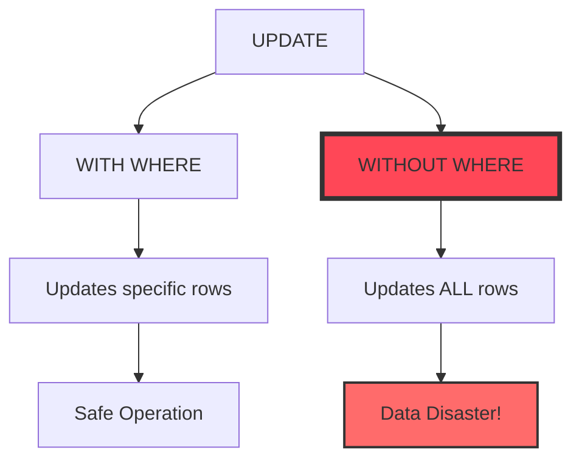

---

## 4. DELETE

Used to **remove rows** from a table.

### Syntax:
```sql
DELETE FROM table_name
WHERE condition;
```

### Example:
```sql
DELETE FROM Employee
WHERE EmpID = 2;
```

### Important: WHERE is CRITICAL!
```sql
DELETE FROM Employee;
```
**All rows are deleted!**

### Table Structure:
- Remains intact
- Columns remain
- Table still exists
- Only data rows are removed

---

## 6. TRUNCATE

Used to remove **all rows** from a table **quickly**.

### Syntax:
```sql
TRUNCATE TABLE Employee;
```

### What It Does:
- Removes all rows
- Keeps table structure
- Generally faster than DELETE all
- Does **not** use WHERE

### Invalid:
```sql
TRUNCATE TABLE Employee WHERE EmpID = 2;   -- ERROR!
```

---

## 7. DELETE vs TRUNCATE

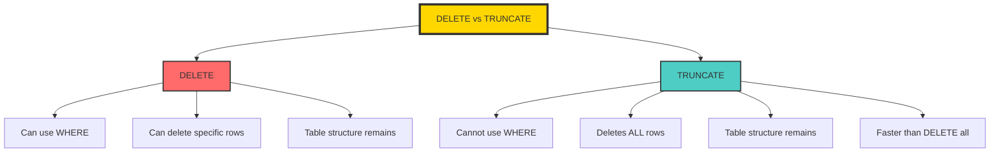

---

## 8. ALTER

Used to **change table structure**.

### Add a Column:
```sql
ALTER TABLE Employee
ADD Email VARCHAR(50);
```

### Drop a Column:
```sql
ALTER TABLE Employee
DROP COLUMN Email;
```

### Modify Column Type:
```sql
ALTER TABLE Employee
MODIFY Salary DECIMAL(10,2);
```

---

## 9. DROP

Used to remove the **entire table itself**.

### Syntax:
```sql
DROP TABLE Employee;
```

### What Happens:
- Table deleted
- All rows deleted
- All columns deleted
- Structure gone completely

---

## 10. Difference: DELETE vs TRUNCATE vs DROP

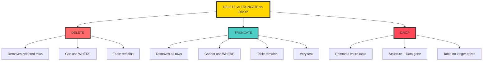

| Operation | Removes | WHERE Allowed | Table Structure | Speed |
|-----------|---------|---------------|-----------------|-------|
| **DELETE** | Selected rows | ✅ Yes | Remains | Moderate |
| **TRUNCATE** | All rows | ❌ No | Remains | Fast |
| **DROP** | Entire table | ❌ No | Gone | Fastest |

---

## 11. UPDATE vs ALTER

Students confuse these!

| UPDATE | ALTER |
|--------|-------|
| Changes **data inside rows** | Changes **table structure** |
| Example: `UPDATE Employee SET Salary = 80000 WHERE EmpID = 1;` | Example: `ALTER TABLE Employee ADD Email VARCHAR(50);` |

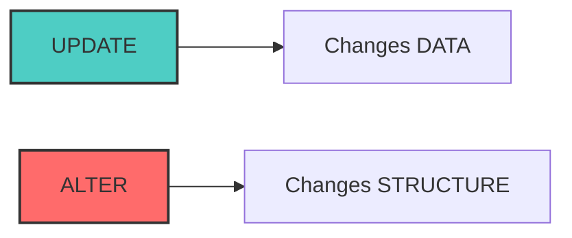

---

# 📝 Day 4 Assignment

## TASK 1 — Java Exception Handling

Write `ExceptionDemo` class with:

### Part A:
```java
try-catch-finally for division:
- int a = 10;
- int b = 0;
- try to print a / b
- catch ArithmeticException and print: "Cannot divide by zero"
- finally print: "Done with division"
```

### Part B:
```java
Another try-catch:
- String s = null;
- try System.out.println(s.length());
- catch NullPointerException and print: "String is null"
```

<details>
<summary><b>✅ Solution</b></summary>

```java
public class ExceptionDemo {
    public static void main(String[] args) {
        // Part A
        try {
            int a = 10;
            int b = 0;
            System.out.println(a / b);
        } catch (ArithmeticException e) {
            System.out.println("Cannot divide by zero");
        } finally {
            System.out.println("Done with division");
        }
        
        // Part B
        try {
            String s = null;
            System.out.println(s.length());
        } catch (NullPointerException e) {
            System.out.println("String is null");
        }
    }
}
```
</details>

---

## TASK 2 — SQL Writing

Using `Employee(EmpID, Name, Department, Salary)`:

1. Update salary of employee with EmpID = 3 to 75000
2. Update department to `'AI'` and salary to `80000` for EmpID = 2
3. Delete employee with EmpID = 5
4. Delete all rows using `DELETE`
5. Remove all rows using `TRUNCATE`
6. Add column `Email VARCHAR(50)`
7. Drop column `Email`
8. Remove the entire Employee table

<details>
<summary><b>✅ Solutions</b></summary>

```sql
-- 1. Update salary
UPDATE Employee
SET Salary = 75000
WHERE EmpID = 3;

-- 2. Update multiple columns
UPDATE Employee
SET Department = 'AI', Salary = 80000
WHERE EmpID = 2;

-- 3. Delete specific employee
DELETE FROM Employee
WHERE EmpID = 5;

-- 4. Delete all rows
DELETE FROM Employee;

-- 5. Truncate table
TRUNCATE TABLE Employee;

-- 6. Add column
ALTER TABLE Employee
ADD Email VARCHAR(50);

-- 7. Drop column
ALTER TABLE Employee
DROP COLUMN Email;

-- 8. Drop table
DROP TABLE Employee;
```
</details>

---

## ❌ Mistake Log

### Mistake 1: Sloppy Exception Variable Naming
- **Issue:** Used unclear variable names in catch blocks
- **Fix:** Use meaningful names like `e` for exception

### Mistake 2: Missing super() in Custom Exception
- **Issue:** Forgot to call `super(message)` in custom exception constructor
- **Fix:** Always call super in custom exception constructors

### Mistake 3: Wrong catch Order
- **Issue:** Put general Exception first
- **Fix:** Specific catch blocks before general catch blocks

### Mistake 4: Forgetting WHERE in UPDATE/DELETE
- **Issue:** Omitted WHERE clause
- **Fix:** Always specify WHERE for UPDATE and DELETE operations

---

## 📊 Key Takeaways

### Java Exception Handling Rules:
1. **try** must have catch or finally
2. **finally** always executes
3. **Specific catches** before general
4. **throw** vs **throws** - different usage
5. **Checked** exceptions forced by compiler
6. **Unchecked** exceptions at runtime

### SQL Data Modification Rules:
1. **UPDATE** needs WHERE (unless updating ALL rows)
2. **DELETE** needs WHERE (unless deleting ALL rows)
3. **TRUNCATE** removes ALL rows (no WHERE)
4. **ALTER** changes structure
5. **DROP** removes entire table

---

## 🏆 Day 5 Score Summary

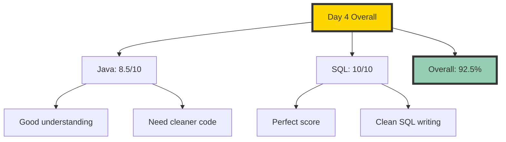

---

## 🚀 Mentor's Verdict

### What You Did Well:
✅ Understood exception handling concepts
✅ Correctly used try-catch-finally
✅ SQL answers were straight and correct

### What Needs Improvement:
⚠️ Code neatness lags behind understanding
⚠️ Variable naming needs more discipline
⚠️ Need sharper writing discipline

### Bottom Line:
> **"Good work. Not finished work."**

You're building an actual base now. Keep stacking days like this!

---

<p align="center">
  <b>✨ Day 5 is now LOCKED! 92.5% Complete ✨</b>
</p>

<p align="center">
  <i>"Errors are not failures - they're opportunities to handle gracefully!"</i>
</p>

---

*Made with 💖 and ☕ during Infosys Preparation Journey*
*Day 5 - JULY 2026*
