# ✨ Day 6 - Strings, StringBuilder, ArrayList & SQL Joins ✨

> *"The magic of data - from single characters to connected tables!"*

[](https://www.java.com/)
[](https://www.oracle.com/java/technologies/)
[](https://www.oracle.com/java/technologies/)
[](https://www.mysql.com/)

---

## 📊 Day 6 Score Card

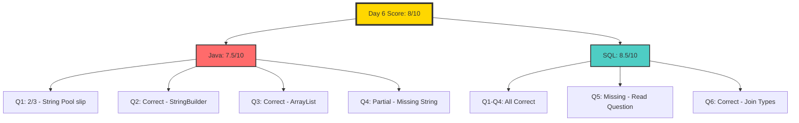

---

## 📚 Table of Contents

1. [Java - Strings](#-java-strings)
   - [String Immutability](#2-most-important-property-of-string-immutable)
   - [String Creation](#4-two-ways-to-create-string)
   - [== vs .equals()](#5--vs-equals)
   - [String Methods](#6-important-string-methods)
2. [Java - StringBuilder & StringBuffer](#-java---stringbuilder--stringbuffer)
3. [Java - ArrayList](#-java---arraylist)
4. [SQL - Joins](#-sql-joins)
5. [Assignment Solutions](#-day-5-assignment-solutions)
6. [Mistake Log](#-mistake-log)
7. [Summary](#-summary)

---

# ☕ Java - Strings

## 1. String in Java

A `String` is an object used to store text.

```java
String name = "Kavya";
```

### Why Strings Matter:
- Names, emails, passwords
- SQL queries, logs
- File paths, messages
- **Very common in MCQs!**

---

## 2. Most Important Property of String: IMMUTABLE

Once a String object is created, **its content cannot be changed**.

### ❌ Example:

```java
String s = "Hello";
s.concat(" World");
System.out.println(s);  // Output: Hello
```

### Why?

`concat()` did **not change** the original string object. It created a **new String object**, but you didn't store it.

### ✅ Correct Way:

```java
String s = "Hello";
s = s.concat(" World");
System.out.println(s);  // Output: Hello World
```

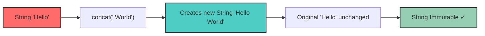

---

## 3. Why String is Immutable

### a) Security 🔒
Strings used in:
- Database usernames/passwords
- File paths, URLs
- Network connections

If String was mutable, someone could alter it after validation!

### b) String Pool Optimization 💾
Java stores string literals in a common pool to save memory. Immutability makes this safe.

### c) Thread Safety 🧵
Immutable objects are safer when multiple threads use them.

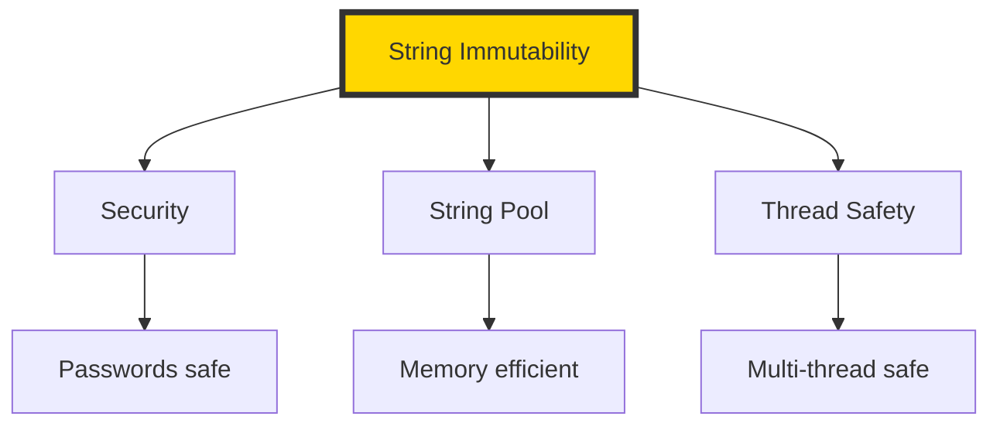

---

## 4. Two Ways to Create String

### Method 1: String Literal

```java
String s1 = "Java";
String s2 = "Java";
```

Both point to the **same object** in the **String Constant Pool**.

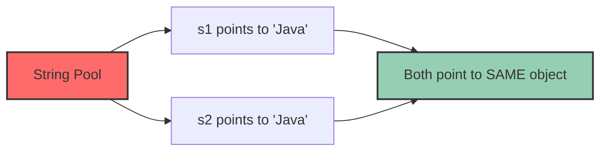

### Method 2: Using `new`

```java
String s3 = new String("Java");
String s4 = new String("Java");
```

New objects are created in **heap memory**.

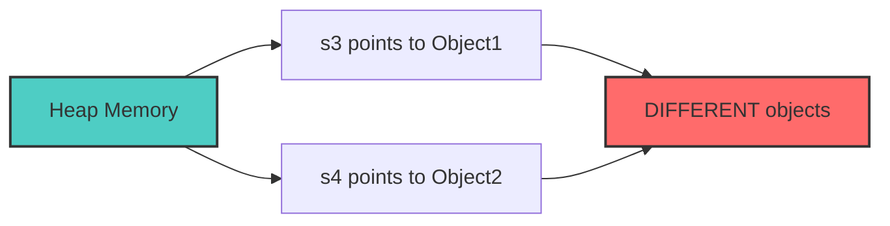

---

## 5. `==` vs `.equals()` ⚠️

This is one of the most important String concepts!

### `==` - Reference Comparison
Checks if two references point to the **same object in memory**.

```java
String a = "Java";
String b = "Java";
System.out.println(a == b);  // true - same object in pool
```

```java
String a = new String("Java");
String b = new String("Java");
System.out.println(a == b);  // false - different objects
```

### `.equals()` - Content Comparison
Checks if the **content/text** is same.

```java
String a = new String("Java");
String b = new String("Java");
System.out.println(a.equals(b));  // true - same content
```

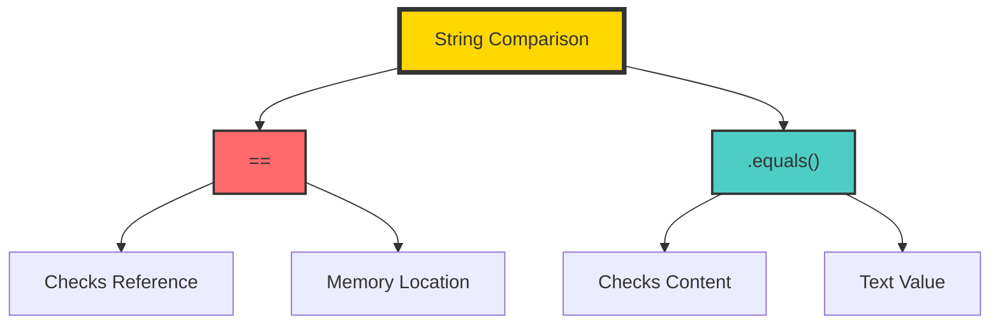

### Golden Rule ⭐

| Comparison | Checks | Use Case |
|------------|--------|----------|
| `==` | Reference / Memory location | Compare if same object |
| `.equals()` | Content / Text | Compare if same value |

**Burn this into your head!**

---

## 6. Important String Methods

### 1) `length()` - Count Characters

```java
String s = "Infosys";
System.out.println(s.length());  // 7
```

### 2) `charAt(index)` - Get Character at Position

```java
String s = "Java";
System.out.println(s.charAt(2));  // v
```

| Index | Character |
|-------|-----------|
| 0 | J |
| 1 | a |
| 2 | v |
| 3 | a |

### 3) `toUpperCase()` - Convert to Uppercase

```java
String s = "java";
System.out.println(s.toUpperCase());  // JAVA
```

### 4) `toLowerCase()` - Convert to Lowercase

```java
String s = "JAVA";
System.out.println(s.toLowerCase());  // java
```

### 5) `contains()` - Check for Substring

```java
String s = "Infosys Mysore";
System.out.println(s.contains("Mys"));  // true
```

### 6) `substring(start, end)` - Extract Part

```java
String s = "Developer";
System.out.println(s.substring(0, 4));  // Deve
```

**Note:** Start index included, End index excluded!

### 7) `equalsIgnoreCase()` - Case Insensitive

```java
String a = "java";
String b = "JAVA";
System.out.println(a.equalsIgnoreCase(b));  // true
```

### 8) `trim()` - Remove Spaces

```java
String s = "   hello   ";
System.out.println(s.trim());  // hello
```

### 9) `replace()` - Replace Characters

```java
String s = "banana";
System.out.println(s.replace('a', 'o'));  // bonono
```

---

# ☕ Java - StringBuilder & StringBuffer

## Why StringBuilder?

String is immutable, so repeated modifications create new objects and waste memory.

### String is Mutable!

```java
StringBuilder sb = new StringBuilder("Hello");
sb.append(" World");
System.out.println(sb);  // Hello World
```


## Common StringBuilder Methods

### `append()`
```java
StringBuilder sb = new StringBuilder("Java");
sb.append(" SQL");
System.out.println(sb);  // Java SQL
```

### `insert(index, value)`
```java
StringBuilder sb = new StringBuilder("Jva");
sb.insert(1, "a");
System.out.println(sb);  // Java
```

### `delete(start, end)`
```java
StringBuilder sb = new StringBuilder("JavaWorld");
sb.delete(4, 9);
System.out.println(sb);  // Java
```

### `reverse()`
```java
StringBuilder sb = new StringBuilder("abc");
sb.reverse();
System.out.println(sb);  // cba
```

## String vs StringBuilder vs StringBuffer

| Feature | String | StringBuilder | StringBuffer |
|---------|--------|---------------|--------------|
| Mutable? | ❌ No | ✅ Yes | ✅ Yes |
| Thread-safe? | ❌ No | ❌ No | ✅ Yes |
| Speed | Slow | Fast | Moderate |
| Use when | Fixed text | Single thread | Multiple threads |

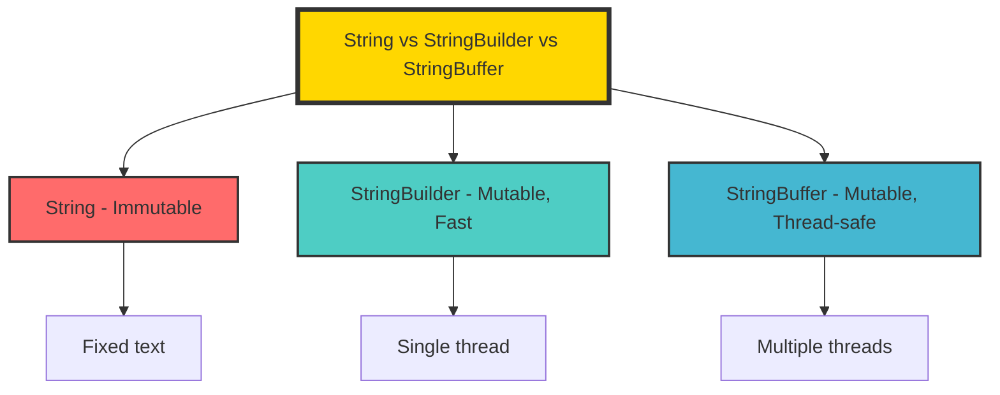

---

# ☕ Java - ArrayList

## What is ArrayList?

An `ArrayList` is a **resizable array**.

### Array vs ArrayList

```java
// Array - Fixed size
int[] arr = new int[5];

// ArrayList - Dynamic size
ArrayList<String> names = new ArrayList<>();
```

## Creating ArrayList

```java
import java.util.ArrayList;

ArrayList<String> names = new ArrayList<>();
```

## Common ArrayList Methods

### `add()` - Add Elements

```java
names.add("Kavya");
names.add("Ravi");
System.out.println(names);  // [Kavya, Ravi]
```

### `get(index)` - Get Element

```java
System.out.println(names.get(0));  // Kavya
```

### `set(index, value)` - Replace Element

```java
names.set(1, "Ram");
System.out.println(names);  // [Kavya, Ram]
```

### `remove(index)` - Remove Element

```java
names.remove(0);
System.out.println(names);  // [Ram]
```

### `size()` - Get Size

```java
System.out.println(names.size());  // 1
```

### `contains(value)` - Check Contains

```java
System.out.println(names.contains("Ram"));  // true
```

## Array vs ArrayList

| Feature | Array | ArrayList |
|---------|-------|-----------|
| Size fixed? | ✅ Yes | ❌ No |
| Can grow dynamically? | ❌ No | ✅ Yes |
| Easy add/remove? | ❌ No | ✅ Yes |
| Useful methods? | Very few | Many |

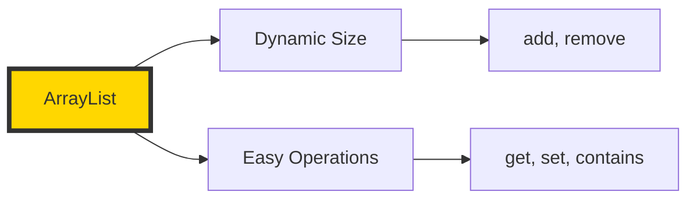

---

## ⚠️ Java MCQ Traps

### Trap 1: String Literal
```java
String s1 = "Java";
String s2 = "Java";
System.out.println(s1 == s2);  // true
```

### Trap 2: String with new
```java
String s1 = new String("Java");
String s2 = new String("Java");
System.out.println(s1 == s2);  // false
```

### Trap 3: equals with new
```java
String s1 = new String("Java");
String s2 = new String("Java");
System.out.println(s1.equals(s2));  // true
```

### Trap 4: Immutability
```java
String s = "Hello";
s.concat("World");
System.out.println(s);  // Hello
```

### Trap 5: StringBuilder Mutable
```java
StringBuilder sb = new StringBuilder("Hello");
sb.append("World");
System.out.println(sb);  // HelloWorld
```

---

# 🗄️ SQL - JOINS

## 1. Why Do We Need JOIN?

In real databases, data is split across multiple tables.

### Employee Table

| EmpID | Name | DeptID |
|-------|------|--------|
| 1 | Kavya | 101 |
| 2 | Ravi | 102 |
| 3 | Anu | 101 |

### Department Table

| DeptID | DeptName |
|--------|----------|
| 101 | AI |
| 102 | Java |
| 103 | Testing |

### The Problem
If we want: **"Show employee name along with department name"**

We need to combine both tables using **JOIN**.

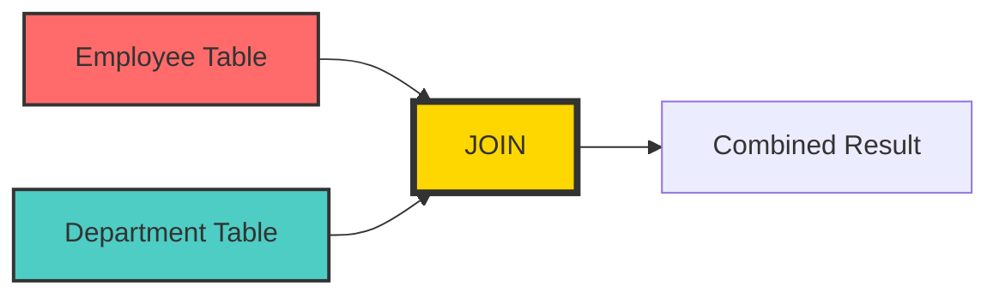

---

## 2. Basic JOIN Idea

A join combines rows from two tables based on a related column.

### The Relationship:
```sql
Employee.DeptID = Department.DeptID
```

---

## 3. INNER JOIN

Returns only the rows where there is a match in both tables.

### Syntax:
```sql
SELECT columns
FROM table1
INNER JOIN table2
ON table1.common_column = table2.common_column;
```

### Example:
```sql
SELECT Employee.Name, Department.DeptName
FROM Employee
INNER JOIN Department
ON Employee.DeptID = Department.DeptID;
```

### Output:

| Name | DeptName |
|------|----------|
| Kavya | AI |
| Ravi | Java |
| Anu | AI |

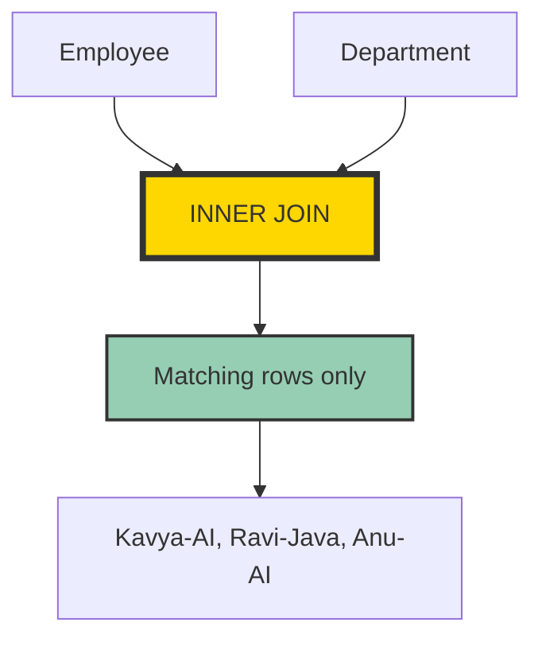

---

## 4. LEFT JOIN

Returns:
- All rows from **left table**
- Matching rows from right table
- If no match, right side = `NULL`

### Syntax:
```sql
SELECT columns
FROM table1
LEFT JOIN table2
ON table1.common_column = table2.common_column;
```

### Example:

| EmpID | Name | DeptID |
|-------|------|--------|
| 1 | Kavya | 101 |
| 2 | Ravi | 102 |
| 3 | Meena | 999 |

```sql
SELECT Employee.Name, Department.DeptName
FROM Employee
LEFT JOIN Department
ON Employee.DeptID = Department.DeptID;
```

### Output:

| Name | DeptName |
|------|----------|
| Kavya | AI |
| Ravi | Java |
| Meena | NULL |

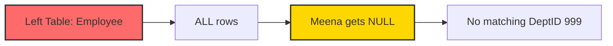

---

## 5. RIGHT JOIN

Returns:
- All rows from **right table**
- Matching rows from left table
- If no match, left side = `NULL`

### Syntax:
```sql
SELECT columns
FROM table1
RIGHT JOIN table2
ON table1.common_column = table2.common_column;
```

### Example:

| DeptID | DeptName |
|--------|----------|
| 101 | AI |
| 102 | Java |
| 103 | Testing |

```sql
SELECT Employee.Name, Department.DeptName
FROM Employee
RIGHT JOIN Department
ON Employee.DeptID = Department.DeptID;
```

### Output:

| Name | DeptName |
|------|----------|
| Kavya | AI |
| Ravi | Java |
| NULL | Testing |


---

## 6. FULL JOIN

Returns:
- All rows from both tables
- Matched rows combined
- Unmatched = `NULL`

### Syntax:
```sql
SELECT columns
FROM table1
FULL OUTER JOIN table2
ON table1.common_column = table2.common_column;
```

---

## 7. JOIN Types Comparison

| Join Type | Returns |
|-----------|---------|
| **INNER JOIN** | Only matching rows from both tables |
| **LEFT JOIN** | All rows from left + matching from right |
| **RIGHT JOIN** | All rows from right + matching from left |
| **FULL JOIN** | All rows from both tables |

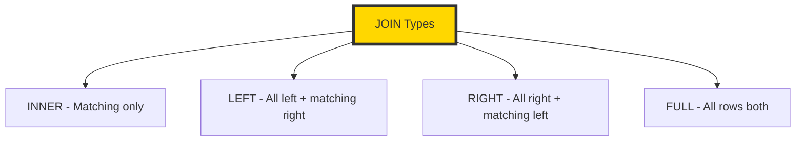

---

## 8. Aliases in JOIN

Cleaner code using aliases:

```sql
SELECT e.Name, d.DeptName
FROM Employee e
INNER JOIN Department d
ON e.DeptID = d.DeptID;
```

Here:
- `e` = Employee
- `d` = Department

---

## 9. JOIN with WHERE

```sql
SELECT e.Name, d.DeptName
FROM Employee e
INNER JOIN Department d
ON e.DeptID = d.DeptID
WHERE d.DeptName = 'AI';
```

---

## 10. Common JOIN Mistakes ⚠️

### Mistake 1: Forgetting ON Condition
```sql
SELECT * FROM Employee INNER JOIN Department;  -- Wrong
```

### Mistake 2: Wrong Join Columns
```sql
ON Employee.EmpID = Department.DeptID  -- Makes no sense!
```

### Mistake 3: Ambiguous Column Names
```sql
SELECT DeptID  -- Which table? Employee or Department?
```

**Correct:**
```sql
SELECT Employee.DeptID
-- or
SELECT e.DeptID
```

---

## 11. Complete Summary Example

### Tables:

**Employee**

| EmpID | Name | DeptID |
|-------|------|--------|
| 1 | Kavya | 101 |
| 2 | Ravi | 102 |
| 3 | Meena | 105 |

**Department**

| DeptID | DeptName |
|--------|----------|
| 101 | AI |
| 102 | Java |
| 103 | Testing |

### Results:

**INNER JOIN:** Kavya-AI, Ravi-Java (Meena excluded)

**LEFT JOIN:** Kavya-AI, Ravi-Java, Meena-NULL

**RIGHT JOIN:** Kavya-AI, Ravi-Java, NULL-Testing

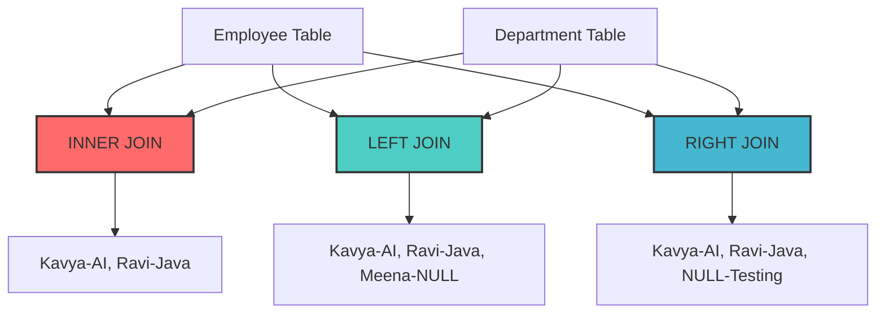

---

# 📝 Day 5 Assignment Solutions

## Part A — Java Solutions

### Q1 — String Comparison

```java
public class StringDemo {
    public static void main(String[] args) {
        String s1 = "Java";
        String s2 = "Java";
        String s3 = new String("Java");
        
        System.out.println(s1 == s2);        // true
        System.out.println(s1 == s3);        // false
        System.out.println(s1.equals(s3));   // true
    }
}
```

### Q2 — StringBuilder

```java
public class StringBuilderDemo {
    public static void main(String[] args) {
        StringBuilder sb = new StringBuilder("Infosys");
        sb.append(" Mysore");
        System.out.println(sb);  // Infosys Mysore
    }
}
```

### Q3 — ArrayList

```java
import java.util.ArrayList;

public class ArrayListDemo {
    public static void main(String[] args) {
        ArrayList<String> names = new ArrayList<>();
        names.add("Kavya");
        names.add("Ravi");
        names.add("Anu");
        
        System.out.println(names);          // [Kavya, Ravi, Anu]
        System.out.println(names.get(0));   // Kavya
        
        names.set(1, "Ram");
        System.out.println(names);          // [Kavya, Ram, Anu]
        
        names.remove(0);
        System.out.println(names);          // [Ram, Anu]
    }
}
```

### Q4 — Theory

#### a) `==` vs `.equals()`
- `==` checks reference/memory location
- `.equals()` checks content/text

#### b) Why String is immutable
- Security (passwords, URLs)
- String Pool optimization
- Thread safety

#### c) String vs StringBuilder vs StringBuffer
- String: Immutable
- StringBuilder: Mutable, faster, not thread-safe
- StringBuffer: Mutable, thread-safe, slower

---

## Part B — SQL Solutions

### Q1 — INNER JOIN

```sql
SELECT Employee.Name, Department.DeptName
FROM Employee
INNER JOIN Department
ON Employee.DeptID = Department.DeptID;
```

### Q2 — LEFT JOIN

```sql
SELECT Employee.Name, Department.DeptName
FROM Employee
LEFT JOIN Department
ON Employee.DeptID = Department.DeptID;
```

### Q3 — RIGHT JOIN

```sql
SELECT Employee.Name, Department.DeptName
FROM Employee
RIGHT JOIN Department
ON Employee.DeptID = Department.DeptID;
```

### Q4 — AI Department

```sql
SELECT Employee.Name, Department.DeptName
FROM Employee
INNER JOIN Department
ON Employee.DeptID = Department.DeptID
WHERE Department.DeptName = 'AI';
```

### Q5 — Using Aliases

```sql
SELECT e.Name, d.DeptName
FROM Employee e
INNER JOIN Department d
ON e.DeptID = d.DeptID;
```

### Q6 — Join Differences

- **INNER JOIN**: Returns only matching rows from both tables
- **LEFT JOIN**: Returns all rows from left table + matching rows from right
- **RIGHT JOIN**: Returns all rows from right table + matching rows from left

---

## ❌ Mistake Log

### Mistake 1: String Pool Confusion
**Issue:** Thought `s1 == s2` was false for string literals
**Truth:** String literals point to same object in String Pool
**Fix:** Remember - literals share the same object!

### Mistake 2: Missing String in Comparison
**Issue:** Only compared StringBuilder vs StringBuffer
**Fix:** Include String - the immutable one!

### Mistake 3: Misread Question
**Issue:** Wrote join definitions for Q5 instead of aliases
**Fix:** Read each question carefully!

---

## 📊 Key Takeaways

### Java String Golden Rules:
1. **String is IMMUTABLE** - content cannot change
2. **`==`** checks reference
3. **`.equals()`** checks content
4. **String literals** share the same object
5. **`new String()`** creates new objects

### SQL Join Golden Rules:
1. **INNER** = matching only
2. **LEFT** = all from left
3. **RIGHT** = all from right
4. **FULL** = all from both
5. Always use **ON** condition
6. Use **aliases** for cleaner code

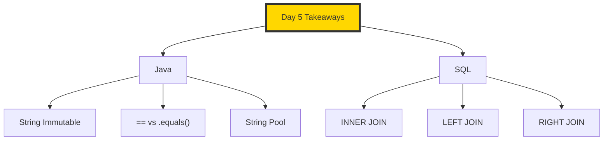

---

## 🚀 Mentor's Verdict

### What You Did Well:
✅ SQL joins are landing - clean syntax
✅ ArrayList basics are fine
✅ Theory answers improving
✅ Understanding the concepts

### What Needs Work:
⚠️ String Pool concept needs tightening
⚠️ Complete answers (don't skip parts)
⚠️ Read questions carefully
⚠️ Mental code tracing before answering

### Bottom Line:
> **"You improved. SQL today = good. Java today = decent, but String concept needs one more tightening."**

**Day 6 Score: 8/10** - Acceptable progress! 🎉

---

<p align="center">
  <b>✨ Day 6 is now LOCKED! 8/10 Complete ✨</b>
</p>

<p align="center">
  <i>"The magic of data - from single characters to connected tables!"</i>
</p>

---

*Made with 💖 and ☕ during Infosys Preparation Journey*
*Day 6 - JULY 2026*
