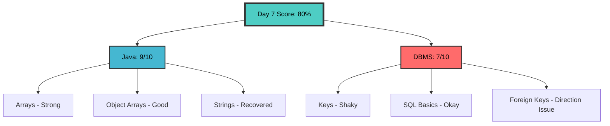
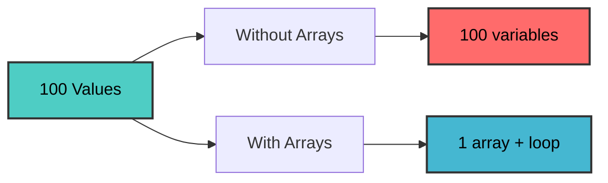
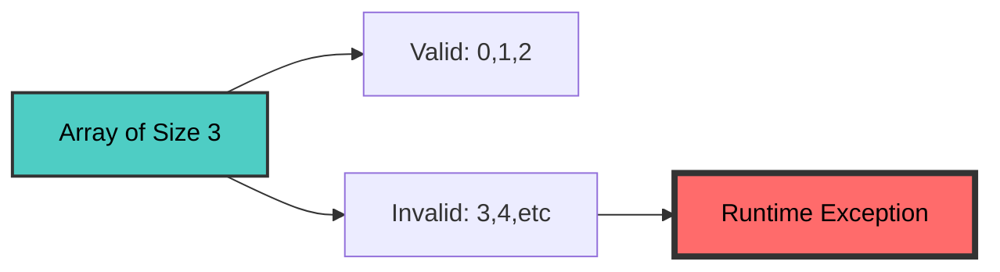
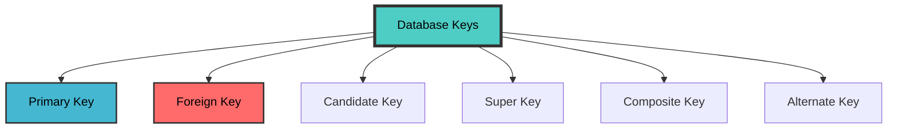
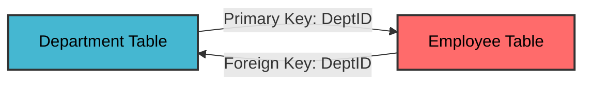
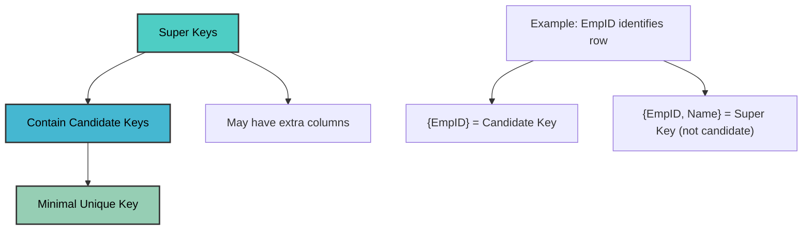

# ✨ Day 7 - Arrays & DBMS Keys ✨

> *"Data organized, data identified, data mastered!"*

[](https://www.java.com/)
[](https://www.oracle.com/java/technologies/)
[](https://www.mysql.com/)
[](https://www.mysql.com/)

---

## 📊 Day 7 Score Card



---

## 📚 Table of Contents

1. [Java - Arrays](#-java-arrays)
   - [What is an Array](#1-what-exactly-is-an-array)
   - [Declaration & Creation](#3-declaring-an-array)
   - [Default Values](#5-default-values-in-arrays)
   - [Array Traversal](#9-traversing-an-array)
   - [Object Arrays](#16-array-of-objects)
   - [Common Traps](#18-common-infosys-style-traps-with-arrays)
2. [DBMS - Keys](#-dbms-keys)
   - [DBMS Basics](#1-what-is-dbms)
   - [Primary Key](#6-primary-key)
   - [Foreign Key](#8-foreign-key)
   - [Candidate vs Super Key](#9-candidate-key)
   - [Other Keys](#12-composite-key)
3. [Advanced Assessment](#-advanced-assessment)
4. [Mistake Log](#-mistake-log)
5. [Summary](#-summary)

---

# ☕ Java - Arrays

## 1. What Exactly is an Array?

An **array** is a fixed-size collection of elements of the **same data type**, stored in an ordered way, and accessed using an **index**.

### Example:
```java
int[] marks = {70, 80, 90, 95};
```

| Index | Value |
|-------|-------|
| 0 | 70 |
| 1 | 80 |
| 2 | 90 |
| 3 | 95 |

### Two Key Properties:
1. **All elements must be of the same type**
   - `int[]` → only integers
   - `String[]` → only strings
   - `Student[]` → only Student objects

2. **Index starts from 0**
   - First element → index 0
   - Last element → index `length - 1`

---

## 2. Why Do Arrays Exist?

### Without Arrays (Ugly):
```java
int m1 = 70;
int m2 = 80;
int m3 = 90;
int m4 = 95;
int m5 = 88;
```

This becomes ugly if:
- There are 100 values
- You need sum/average
- You need max/min
- You need loop-based processing

### With Arrays (Elegant):
```java
int[] marks = {70, 80, 90, 95, 88};
// Now you can loop through all values!
```



---

## 3. Declaring an Array

### Syntax:
```java
datatype[] arrayName;
```

### Examples:
```java
int[] arr;
String[] names;
double[] salary;
```

**Important:** At this stage, only the **reference variable** is declared - actual memory for elements is **not created yet**.

---

## 4. Creating an Array

```java
arr = new int[5];
```

Now Java creates space for **5 integers**.

### Combined:
```java
int[] arr = new int[5];
```

This means:
- Create an integer array of size 5
- Valid indexes = `0, 1, 2, 3, 4`

---

## 5. Default Values in Arrays

When you create an array with `new`, Java fills it with default values.

### Primitive Types:

| Type | Default Value |
|------|---------------|
| `int` | 0 |
| `double` | 0.0 |
| `float` | 0.0 |
| `char` | `'\u0000'` |
| `boolean` | false |

### Reference Types:
- `String[]` → all elements initially `null`
- `Student[]` → all elements initially `null`

### Example:
```java
int[] arr = new int[3];
System.out.println(arr[0]); // 0
System.out.println(arr[1]); // 0
System.out.println(arr[2]); // 0
```

---

## 6. Array Initialization in One Shot

Instead of creating empty array and assigning one by one:
```java
int[] arr = {10, 20, 30, 40};
```

This means:
- Array size = 4
- Values assigned immediately

---

## 7. Accessing Array Elements

### Using Index:
```java
int[] arr = {10, 20, 30};
System.out.println(arr[0]); // 10
System.out.println(arr[2]); // 30
```

### Updating Values:
```java
arr[1] = 99;
System.out.println(arr[1]); // 99
```

---

## 8. Array Length

Every array has a property called `length`.

```java
int[] arr = {10, 20, 30, 40};
System.out.println(arr.length); // 4
```

### ⚠️ Important:
It is:
```java
arr.length
```
**NOT**
```java
arr.length()  // ❌ ERROR!
```

---

## 9. Traversing an Array

"Traversing" means visiting every element one by one.

### Using `for` Loop:
```java
int[] arr = {10, 20, 30, 40};

for (int i = 0; i < arr.length; i++) {
    System.out.println(arr[i]);
}
```

### How It Works:

| i | arr[i] | Output |
|---|--------|--------|
| 0 | arr[0] | 10 |
| 1 | arr[1] | 20 |
| 2 | arr[2] | 30 |
| 3 | arr[3] | 40 |

---

## 10. Sum of Array Elements

```java
int[] arr = {10, 20, 30, 40};
int sum = 0;

for (int i = 0; i < arr.length; i++) {
    sum = sum + arr[i];
}

System.out.println(sum); // 100
```

### Step-by-Step:

| Step | Operation | Sum |
|------|-----------|-----|
| Start | `sum = 0` | 0 |
| 1 | `sum + 10` | 10 |
| 2 | `sum + 20` | 30 |
| 3 | `sum + 30` | 60 |
| 4 | `sum + 40` | 100 |

---

## 11. Finding Maximum Element

```java
int[] arr = {45, 12, 78, 34, 89};
int max = arr[0];

for (int i = 1; i < arr.length; i++) {
    if (arr[i] > max) {
        max = arr[i];
    }
}

System.out.println(max); // 89
```

### Dry Run:

| i | arr[i] | max | Change? |
|---|--------|-----|---------|
| Start | - | 45 | - |
| 1 | 12 | 45 | No |
| 2 | 78 | 78 | Yes |
| 3 | 34 | 78 | No |
| 4 | 89 | 89 | Yes |

---

## 12. Finding Minimum Element

```java
int[] arr = {45, 12, 78, 34, 89};
int min = arr[0];

for (int i = 1; i < arr.length; i++) {
    if (arr[i] < min) {
        min = arr[i];
    }
}

System.out.println(min); // 12
```

---

## 13. Enhanced for Loop

```java
int[] arr = {10, 20, 30};

for (int x : arr) {
    System.out.println(x);
}
```

### When Useful:
- Printing values
- Summing values

### When Not Enough:
- When you need **index**
- When you want to modify specific positions

---

## 14. ArrayIndexOutOfBoundsException ⚠️

```java
int[] arr = {5, 10, 15};
```

### Valid Indexes:
- 0
- 1
- 2

### ❌ Invalid:
```java
System.out.println(arr[3]); // ❌ ArrayIndexOutOfBoundsException
```



---

## 15. Reverse Traversal

```java
int[] arr = {1, 2, 3, 4};

for (int i = arr.length - 1; i >= 0; i--) {
    System.out.print(arr[i] + " ");
}
// Output: 4 3 2 1
```

---

## 16. Array of Objects

### Student Class:
```java
class Student {
    String name;
    
    Student(String name) {
        this.name = name;
    }
    
    void display() {
        System.out.println(name);
    }
}
```

### Creating Array:
```java
Student[] students = new Student[3];
```

### What This Does:
- Creates an array of size 3
- Capable of storing **3 Student references**
- **Does NOT create 3 Student objects automatically**

### Initially:
```java
students[0] = null
students[1] = null
students[2] = null
```

### Creating Objects:
```java
students[0] = new Student("Kavya");
students[1] = new Student("Sai");
students[2] = new Student("Riya");
```

### Accessing:
```java
for (int i = 0; i < students.length; i++) {
    students[i].display();
}
// Output: Kavya, Sai, Riya
```

---

## 17. Important Trap with Object Arrays

```java
Student[] s = new Student[2];
System.out.println(s[0]); // null
```

```java
s[0].display(); // ❌ NullPointerException!
```

```
graph TD
    A[Student Array] --> B[s[0] = null]
    A --> C[s[1] = null]
    B --> D[Calling method on null]
    D --> E[NullPointerException]
    
    style A fill:#4ecdc4,stroke:#333,stroke-width:2px,color:#000
    style E fill:#ff6b6b,stroke:#333,stroke-width:4px,color:#000
```

---

## 18. Common Infosys-Style Traps with Arrays

### Trap 1: Default Values
```java
int[] arr = new int[3];
System.out.println(arr[1]); // 0
```

### Trap 2: length
```java
int[] arr = {1,2,3,4};
System.out.println(arr.length); // 4
```

### Trap 3: Out of Bounds
```java
int[] arr = {1,2,3};
System.out.println(arr[3]); // ❌ Runtime Exception
```

### Trap 4: Loop Boundary
```java
for(int i = 0; i <= arr.length; i++) // ❌ DANGEROUS!
```

**Correct:**
```java
for(int i = 0; i < arr.length; i++) // ✅
```

### Trap 5: Object Array Null
```java
Student[] s = new Student[2];
System.out.println(s[0]);   // null
s[0].display();             // ❌ NullPointerException
```

---

## 19. Practical View

### Arrays Are Used When:
- Size is fixed or known
- Data is of same type
- Fast indexed access is needed

### Examples:
- Marks of 5 subjects
- Monthly sales for 12 months
- Temperatures of 7 days
- List of 10 employee IDs

---

## 20. What You Should Take From Arrays Today

You should be able to:

1. ✅ Declare and create arrays
2. ✅ Initialize arrays
3. ✅ Access elements by index
4. ✅ Use `length`
5. ✅ Traverse using loop
6. ✅ Find sum / max
7. ✅ Understand out-of-bounds error
8. ✅ Understand object arrays and `null` references

---

# 🗄️ DBMS - Keys

## 1. What is DBMS?

**DBMS = Database Management System**

### It helps us:
- Store data
- Organize data
- Retrieve data
- Update data
- Manage data efficiently

### Examples:
- MySQL
- Oracle
- PostgreSQL
- SQL Server

### Without DBMS:
- Duplicate data
- Inconsistent data
- Difficult search
- Difficult updates
- Poor security

---

## 2. DBMS vs RDBMS

| Feature | DBMS | RDBMS |
|---------|------|-------|
| Full Form | Database Management System | Relational Database Management System |
| Data Storage | Various formats | Tables |
| Relationships | May not support | Supports relationships |
| Examples | General DB systems | MySQL, Oracle, PostgreSQL |

### In Short:
- **DBMS** = broad term
- **RDBMS** = relational, table-based DBMS with relationships

---

## 3. Table, Row, Column

### Example: Employee Table

| EmpID | Name | DeptID |
|-------|------|--------|
| 1 | Kavya | 101 |
| 2 | Sai | 102 |

### Here:
- **Table** = Employee
- **Rows** = Each record (Kavya's data, Sai's data)
- **Columns** = EmpID, Name, DeptID

---

## 4. What is a Key in DBMS?

A **key** is an attribute (or set of attributes) used to:
- Identify rows
- Create relationships between tables

### Why Keys Matter:
- Prevent confusion between rows
- Help uniquely identify data
- Help connect tables

---

## 5. Key Types Overview



---

## 6. Primary Key

A **Primary Key** uniquely identifies each row in a table.

### Properties:
1. ✅ Must be **unique**
2. ✅ Cannot be **NULL**

### Example:
| EmpID | Name | DeptID |
|-------|------|--------|
| 1 | Kavya | 101 |
| 2 | Sai | 102 |

`EmpID` is a good primary key because:
- No two employees have same EmpID
- EmpID is never null

### ❌ Bad Primary Key Examples:
- `Name` → Names can repeat
- `DeptID` → Multiple employees same department

---

## 7. Foreign Key

A **Foreign Key** is a column in one table that refers to the **Primary Key of another table**.

### Example Tables:

**Department Table:**
| DeptID | DeptName |
|--------|----------|
| 101 | AI |
| 102 | Java |

**Employee Table:**
| EmpID | Name | DeptID |
|-------|------|--------|
| 1 | Kavya | 101 |
| 2 | Sai | 102 |

### Here:
- `Department.DeptID` = Primary Key
- `Employee.DeptID` = Foreign Key (referencing Department)



---

## 8. Candidate Key

A **Candidate Key** is any column (or set of columns) that:
- Can uniquely identify each row
- Is eligible to become a primary key

### Example:
**Student Table:**
- RollNo → Unique for each student
- Email → Unique for each student

Both are **candidate keys**.

### Key Point:
Out of candidate keys, **one is chosen as primary key**.

---

## 9. Super Key

A **Super Key** is any set of attributes that can uniquely identify a row.

### Example:
If `EmpID` alone identifies a row:
- `{EmpID}` → Super key ✅
- `{EmpID, Name}` → Super key ✅
- `{EmpID, DeptID}` → Super key ✅

### Important:
- **Every candidate key is a super key**
- **Every super key is NOT a candidate key**

---

## 10. Candidate Key vs Super Key



### Golden Rule:
- **Candidate Key** = minimal unique identifier
- **Super Key** = unique identifier, may have extra columns

---

## 11. Composite Key

A key formed by **more than one column**.

### Example:
**CourseEnrollment Table:**

| StudentID | CourseID | Semester |
|-----------|----------|----------|
| 101 | C001 | 1 |
| 102 | C001 | 1 |
| 101 | C002 | 1 |

Neither alone is enough:
- `StudentID` alone → Student can enroll in multiple courses
- `CourseID` alone → Many students can enroll

### Solution:
`(StudentID, CourseID)` together uniquely identifies each row → **Composite Key**

---

## 12. Alternate Key

Candidate keys that are **not chosen** as primary key.

### Example:
- `RollNo` → Candidate Key
- `Email` → Candidate Key

If `RollNo` is chosen as Primary Key:
- `Email` becomes **Alternate Key**

---

## 13. Why Keys Matter in Real Life

### Without Keys:
- Duplicate rows possible
- Impossible to identify exact record
- Joins become meaningless
- Relationships break
- Update/delete anomalies

### Keys Provide:
- ✅ Unique identification
- ✅ Relationship management
- ✅ Data integrity
- ✅ Efficient queries

---

## 14. Complete Example

### Employee Table:

| EmpID | Name | DeptID | Email |
|-------|------|--------|-------|
| 1 | Kavya | 101 | kavya@email.com |
| 2 | Sai | 102 | sai@email.com |

### Key Analysis:
- `EmpID` → Candidate Key, can be Primary Key
- `Email` → Candidate Key (if unique)
- If `EmpID` chosen as Primary Key → `Email` becomes Alternate Key
- `DeptID` → Foreign Key (references Department table)

---

## 15. Key Summary Table

| Key Type | Meaning |
|----------|---------|
| **Primary Key** | Chosen unique identifier, not null |
| **Foreign Key** | Refers to primary key of another table |
| **Candidate Key** | Possible primary key (minimal unique) |
| **Super Key** | Any set that uniquely identifies row |
| **Composite Key** | Key made of multiple columns |
| **Alternate Key** | Candidate key not chosen as primary key |

---

## 16. Common MCQ Traps

### Trap 1:
❌ "Primary key can be NULL"
✅ **FALSE** - Primary key must be NOT NULL

### Trap 2:
❌ "Foreign key must always be unique"
✅ **FALSE** - Foreign key can repeat (many employees can be in same department)

### Trap 3:
❌ "Every super key is a candidate key"
✅ **FALSE** - Super key may contain extra columns

### Trap 4:
✅ "Candidate key can be chosen as primary key"
✅ **TRUE** - That's exactly what happens

---

## 17. What You Should Take From DBMS Today

You should be able to answer:

1. ✅ What DBMS is
2. ✅ DBMS vs RDBMS
3. ✅ Primary key properties
4. ✅ Foreign key meaning
5. ✅ Candidate key vs super key
6. ✅ Composite key
7. ✅ Alternate key
8. ✅ Common trap statements

---

# 📝 Advanced Assessment

## SECTION A — JAVA / ARRAYS / OOP LOGIC

### Q1. Predict the output
```java
int[] arr = {10, 20, 30, 40};
System.out.println(arr[0] + arr[2]);
System.out.println(arr.length);
```

<details>
<summary><b>✅ Answer</b></summary>

```
40
4
```
</details>

---

### Q2. Predict the output
```java
int[] arr = new int[4];
arr[1] = 5;
arr[3] = arr[1] + 7;
System.out.println(arr[0] + " " + arr[3]);
```

<details>
<summary><b>✅ Answer</b></summary>

```
0 12
```
</details>

---

### Q3. Predict the output
```java
int[] arr = {2, 4, 6, 8};
int sum = 0;
for(int i = 0; i < arr.length; i++) {
    if(arr[i] % 4 == 0)
        sum += arr[i];
}
System.out.println(sum);
```

<details>
<summary><b>✅ Answer</b></summary>

```
12
```
</details>

---

### Q4. Predict the output
```java
int[] arr = {5, 10, 15, 20};
for(int i = arr.length - 1; i >= 1; i--) {
    System.out.print(arr[i] - arr[i - 1] + " ");
}
```

<details>
<summary><b>✅ Answer</b></summary>

```
5 5 5
```
</details>

---

### Q5. What happens here?
```java
int[] arr = {1, 2, 3};
for(int i = 0; i <= arr.length; i++) {
    System.out.print(arr[i] + " ");
}
```

**Options:**
- A) `1 2 3`
- B) `1 2 3 0`
- C) Compile-time error
- D) Runtime exception after printing some values

<details>
<summary><b>✅ Answer</b></summary>

**D) Runtime exception after printing some values**

Because `i` goes to 3 (arr.length), but valid indices are 0,1,2.
</details>

---

### Q6. Predict the output
```java
class Student {
    String name;
    Student(String name) {
        this.name = name;
    }
}

public class Main {
    public static void main(String[] args) {
        Student[] s = new Student[3];
        s[0] = new Student("A");
        s[2] = new Student("C");
        System.out.println(s[1]);
    }
}
```

<details>
<summary><b>✅ Answer</b></summary>

```
null
```
</details>

---

### Q7. What happens?
```java
class Student {
    void show() {
        System.out.println("Hello");
    }
}

public class Main {
    public static void main(String[] args) {
        Student[] s = new Student[2];
        s[0].show();
    }
}
```

**Options:**
- A) prints Hello
- B) prints null
- C) compile-time error
- D) runtime exception

<details>
<summary><b>✅ Answer</b></summary>

**D) runtime exception** (NullPointerException)
</details>

---

### Q8. Predict the output
```java
String s1 = "Infosys";
String s2 = new String("Infosys");
String s3 = "Infosys";

System.out.println(s1 == s2);
System.out.println(s1 == s3);
System.out.println(s2.equals(s3));
```

<details>
<summary><b>✅ Answer</b></summary>

```
false
true
true
```
</details>

---

### Q9. Predict the output
```java
class A {
    void show() {
        System.out.println("A");
    }
}
class B extends A {
    void show() {
        System.out.println("B");
    }
}
class C extends B {
    void show() {
        System.out.println("C");
    }
}

public class Main {
    public static void main(String[] args) {
        A obj = new C();
        obj.show();
    }
}
```

<details>
<summary><b>✅ Answer</b></summary>

```
C
```
</details>

---

### Q10. Which statement is correct?

- A) `new int[5]` creates array with `null` values
- B) `arr.length()` is used to find array size
- C) An array of objects stores object references
- D) Accessing `arr[arr.length]` gives last element

<details>
<summary><b>✅ Answer</b></summary>

**C) An array of objects stores object references**
</details>

---

## SECTION B — DBMS / KEYS / SQL BASICS

### Q11. Which of the following can be a valid Primary Key?

- A) A column containing duplicate values
- B) A column containing NULL values
- C) A column that uniquely identifies every row and never contains NULL
- D) Any text column, whether unique or not

<details>
<summary><b>✅ Answer</b></summary>

**C) A column that uniquely identifies every row and never contains NULL**
</details>

---

### Q12. Consider the tables:

**Department:**
| DeptID | DeptName |
|--------|----------|
| 101 | AI |
| 102 | Java |

**Employee:**
| EmpID | Name | DeptID |
|-------|------|--------|
| 1 | Kavya | 101 |
| 2 | Sai | 102 |
| 3 | Ravi | 101 |

Which statement is correct?

- A) `Employee.DeptID` should be primary key of Employee
- B) `Department.DeptID` can be a foreign key referencing Employee
- C) `Employee.DeptID` can be a foreign key referencing `Department.DeptID`
- D) `DeptName` must be primary key of Department

<details>
<summary><b>✅ Answer</b></summary>

**C) `Employee.DeptID` can be a foreign key referencing `Department.DeptID`**
</details>

---

### Q13. Which statement is true?

- A) Every super key is a candidate key
- B) Every candidate key is a super key
- C) Foreign key must always be unique
- D) Primary key can be NULL if table has only one row

<details>
<summary><b>✅ Answer</b></summary>

**B) Every candidate key is a super key**
</details>

---

### Q14. A table has columns:
- `EmpID`
- `Email`
- `Phone`

All three are unique for every employee. One is chosen as primary key. The remaining unique columns are called:

- A) Foreign keys
- B) Alternate keys
- C) Composite keys
- D) Derived keys

<details>
<summary><b>✅ Answer</b></summary>

**B) Alternate keys**
</details>

---

### Q15. Which is a composite key example?

- A) `EmpID` alone identifies employee
- B) `RollNo` alone identifies student
- C) `(StudentID, CourseID)` together identify a row
- D) `Email` alone identifies user

<details>
<summary><b>✅ Answer</b></summary>

**C) `(StudentID, CourseID)` together identify a row**
</details>

---

### Q16. Which SQL query correctly displays all rows from Employee sorted by salary descending?

- A) `SELECT * FROM Employee SORT BY Salary DESC;`
- B) `SELECT * FROM Employee ORDER BY Salary DESC;`
- C) `SELECT * FROM Employee GROUP BY Salary DESC;`
- D) `SELECT * FROM Employee WHERE Salary DESC;`

<details>
<summary><b>✅ Answer</b></summary>

**B) `SELECT * FROM Employee ORDER BY Salary DESC;`**
</details>

---

### Q17. Which query counts all rows in Employee table?

- A) `SELECT COUNT(Salary) FROM Employee;`
- B) `SELECT TOTAL(*) FROM Employee;`
- C) `SELECT COUNT(*) FROM Employee;`
- D) `SELECT ROWCOUNT(*) FROM Employee;`

<details>
<summary><b>✅ Answer</b></summary>

**C) `SELECT COUNT(*) FROM Employee;`**
</details>

---

### Q18. Which statement about `COUNT(column_name)` is correct?

- A) It counts all rows including NULL values in that column
- B) It counts only rows where that column is not NULL
- C) It counts distinct values only
- D) It works only with numeric columns

<details>
<summary><b>✅ Answer</b></summary>

**B) It counts only rows where that column is not NULL**
</details>

---

### Q19. Which SQL query correctly displays employee names whose salary is greater than 50000?

- A) `SELECT Name FROM Employee WHERE Salary > 50000;`
- B) `SELECT Name IF Salary > 50000 FROM Employee;`
- C) `SELECT Name FROM Employee ORDER BY Salary > 50000;`
- D) `SELECT Name FROM Employee HAVING Salary > 50000;`

<details>
<summary><b>✅ Answer</b></summary>

**A) `SELECT Name FROM Employee WHERE Salary > 50000;`**
</details>

---

### Q20. Which statement is **false**?

- A) A foreign key is used to create relationship between tables
- B) A primary key uniquely identifies a row
- C) A super key may contain extra unnecessary attributes
- D) A candidate key can contain duplicate values

<details>
<summary><b>✅ Answer</b></summary>

**D) A candidate key can contain duplicate values**
</details>

---

## ❌ Mistake Log

### Mistake 1: Loop Boundary Error
**Issue:** Picked wrong option for loop with `i <= arr.length`
**Truth:** Last valid index is `arr.length - 1`
**Fix:** Always use `i < arr.length`

### Mistake 2: Foreign Key Direction
**Issue:** Got relationship direction backwards
**Truth:** Parent table holds primary key, child holds foreign key
**Fix:** Remember - Department → Employee direction

### Mistake 3: Candidate vs Super Key
**Issue:** Thought every super key is candidate key
**Truth:** Candidate key = minimal, Super key may have extra columns
**Fix:** "Every candidate key is a super key, but not vice versa"

### Mistake 4: COUNT(column)
**Issue:** Thought it counts all rows
**Truth:** `COUNT(column)` ignores NULL values
**Fix:** `COUNT(*)` = all rows, `COUNT(column)` = non-null only

---

## 📊 Key Takeaways

### Java Arrays Golden Rules:
1. Index starts at 0
2. `length` is property (not method)
3. Last index = `arr.length - 1`
4. Default values: `0` for int, `null` for objects
5. Object arrays store references, not objects
6. Calling method on `null` → NullPointerException

### DBMS Keys Golden Rules:
1. Primary Key = unique + not null
2. Foreign Key = references primary key of another table
3. Candidate Key = minimal unique identifier
4. Super Key = unique identifier (may have extras)
5. Composite Key = multiple columns together
6. Alternate Key = candidate key not chosen as primary

---

## 🏆 Day 6 Summary

| Section | Score | Status |
|---------|-------|--------|
| Java/Arrays | 9/10 | ⭐⭐⭐⭐ |
| DBMS/Keys | 7/10 | ⭐⭐⭐ |
| **Overall** | **80%** | 🎯 |

---

## 🚀 Mentor's Verdict

### What You Did Well:
✅ Java arrays section - strong performance
✅ Object array behavior understood
✅ String pool concept corrected
✅ Basic SQL command recall okay

### What Needs Work:
⚠️ Loop boundary awareness - don't go out of bounds
⚠️ Foreign key direction - know which references which
⚠️ Candidate vs Super key - internalize the difference
⚠️ COUNT(column) behavior - NULLs are ignored

### Bottom Line:
> **"Java today was strong. DBMS was shaky."**

**Day 7: 80%** - A good Java day, a warning DBMS day!

---

<p align="center">
  <b>✨ Day 7 is now LOCKED! 80% Complete ✨</b>
</p>

<p align="center">
  <i>"Data organized, data identified, data mastered!"</i>
</p>

---

*Made with 💖 and ☕ during Infosys Preparation Journey*
*Day 7 - July 2026*
