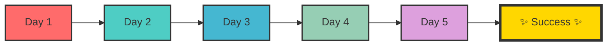
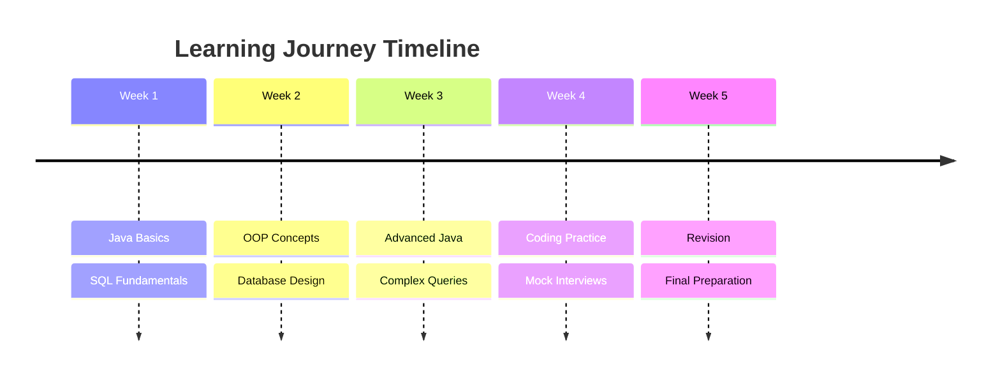

# ✨ Infosys Prep Journey ✨

> *"Consistency is the bridge between dreams and reality"*

[](https://www.java.com/)
[](https://www.mysql.com/)
[](https://github.com/)
[](https://www.infosys.com/)
[]()

---

## 🌟 Welcome to My Learning Odyssey!

A **magical** structured day-by-day preparation repository for Infosys training, containing Java, SQL, OOP, DBMS, coding practice, revision notes, and interview preparation. This repo documents my learning progress, practice work, mistakes, and topic-wise revision as I strengthen core computer science fundamentals before joining Infosys.

<p align="center">
  
</p>

---

## 🎯 Objective

> *"The journey of a thousand miles begins with a single step"*

The purpose of this repository is to maintain a clear and consistent record of my Infosys preparation journey. It serves as a personal learning space to:

- 📝 Revise technical concepts
- 💻 Practice problems
- 📊 Track daily progress
- 📚 Organize topic-wise notes
- 🎯 Build confidence for Infosys technical training

---

## 🔮 Topics Covered

<div align="center">

| 🚀 Topic | 📊 Status | 🎨 Badge |
|----------|-----------|----------|
| Java | 🔄 In Progress |  |
| OOP | 🔄 In Progress |  |
| SQL | 🔄 In Progress |  |
| DBMS | 🔄 In Progress |  |
| Coding Practice | 🔄 In Progress |  |
| Interview Questions | 🔄 In Progress |  |

</div>

---

## 📁 Repository Structure

```
Infosys-Prep-Journey/
│
├── 📖 README.md
│
├── 📅 Day-01/
│   ├── 📝 Notes.md
│   ├── 🗄️ SQL-Practice.md
│   ├── ☕ Java-OOP.md
│   └── 📋 Assignment-QA.md
│
├── 📅 Day-02/
│   ├── 📝 Notes.md
│   └── ...
│
├── 📚 Topic-Wise-Notes/
│   ├── ☕ Java.md
│   ├── 🧬 OOP.md
│   ├── 🗄️ SQL.md
│   ├── 📊 DBMS.md
│   └── 🎯 Interview-Prep.md
│
└── 📦 Resources/
    ├── 📄 PDFs/
    ├── 📸 Screenshots/
    └── 📚 Reference-Material/
```

<p align="center">
  
</p>

---

## 🚀 How I'm Using This Repository

### 🌟 Daily Rituals

- 📝 **Uploading daily study notes** and practice work
- 📚 **Maintaining topic-wise revision notes** for quick reference
- 🔍 **Recording mistakes** and concepts that need rework
- 💪 **Practicing technical questions** related to Infosys training
- 📈 **Tracking consistency** and preparation progress before joining

### 🎨 Colorful Progress Tracking



---

## 📊 Progress Tracker

### 🌈 Day 01 - The Beginning

| Aspect | Details |
|--------|---------|
| 📚 **Topics covered** | Access Modifiers, Inheritance, SQL Basics |
| 🎯 **Key concepts revised** | Private, Default, Protected, Public, SELECT, WHERE, ORDER BY |
| 💻 **Practice completed** | BankAccount class, SQL queries |
| 🔍 **Mistakes / doubts** | Syntax errors, naming inconsistencies |
| 🎯 **Next revision targets** | Method Overriding, Polymorphism |

### 🚀 Day 02 - Building Momentum

| Aspect | Details |
|--------|---------|
| 📚 **Topics covered** | _Coming soon..._ |
| 🎯 **Key concepts revised** | _Coming soon..._ |
| 💻 **Practice completed** | _Coming soon..._ |
| 🔍 **Mistakes / doubts** | _Coming soon..._ |
| 🎯 **Next revision targets** | _Coming soon..._ |

### 💫 Day 03 - Gaining Confidence

| Aspect | Details |
|--------|---------|
| 📚 **Topics covered** | _Coming soon..._ |
| 🎯 **Key concepts revised** | _Coming soon..._ |
| 💻 **Practice completed** | _Coming soon..._ |
| 🔍 **Mistakes / doubts** | _Coming soon..._ |
| 🎯 **Next revision targets** | _Coming soon..._ |

---

## 🎯 Current Focus Areas

<div align="center">

| 🎯 Focus Area | 🔄 Status | 📈 Progress |
|---------------|-----------|-------------|
| Strengthening Java fundamentals | 🔄 In Progress | ████████░░░ 80% |
| Revising SQL and DBMS concepts | 🔄 In Progress | ██████░░░░░ 60% |
| Improving coding practice | 🔄 In Progress | ███████░░░░ 70% |
| Building confidence for assessments | 🔄 In Progress | █████░░░░░░ 50% |

</div>

---

## 🌟 Special Features

### 📚 Daily Themes
- **Day 1**: 🚀 Launch Day - Access Modifiers & SQL Basics
- **Day 2**: 💪 Building Blocks - OOP & Database Design
- **Day 3**: 🎨 Creative Coding - Advanced Concepts
- **Day 4**: 🔍 Deep Dive - Complex Queries
- **Day 5**: 🏆 Mastery - Full Review

### 🎨 Visual Learning
- Color-coded notes for better retention
- Flowcharts and diagrams for complex concepts
- Progress bars for motivation tracking
- Emoji-rich content for engagement

### 💡 Practice Philosophy
> *"Practice is not about perfection, it's about progress"*

---

## 🛠️ Tools & Technologies

<div align="center">

| 🛠️ Tool | 🎯 Purpose | 📊 Status |
|----------|------------|-----------|
| **Visual Studio Code** | Primary IDE | ✅ Active |
| **Git & GitHub** | Version Control | ✅ Active |
| **MySQL** | Database Practice | ✅ Active |
| **Java JDK** | Java Development | ✅ Active |
| **IntelliJ IDEA** | Java IDE | 🔄 Optional |

</div>

---

## 📚 Resource Library

### 🌟 Essential Resources
1. **Java Documentation** - Official Oracle docs
2. **W3Schools SQL** - Interactive SQL practice
3. **GeeksforGeeks** - DSA practice
4. **LeetCode** - Coding challenges
5. **Infosys Training Material** - Official resources

### 🎨 Visual Resources
- **Draw.io** - Diagram creation
- **Code Snapshots** - Visual code examples
- **Progress Charts** - Visual tracking

---

## 🌈 Learning Milestones



---

## 🎯 Success Metrics

| 🏆 Goal | 📊 Target | 📈 Current |
|---------|-----------|------------|
| **Java Proficiency** | ⭐⭐⭐⭐⭐ | ⭐⭐⭐⭐ |
| **SQL Mastery** | ⭐⭐⭐⭐⭐ | ⭐⭐⭐ |
| **Coding Speed** | ⭐⭐⭐⭐⭐ | ⭐⭐⭐⭐ |
| **Problem Solving** | ⭐⭐⭐⭐⭐ | ⭐⭐⭐ |

---

## 💫 Motivation Corner

> *"The expert in anything was once a beginner"*

> *"Success is the sum of small efforts, repeated day in and day out"*

> *"Your limitation—it's only your imagination"*

---

## 📝 Daily Checklist

<details>
<summary><b>📋 Daily Preparation Checklist</b></summary>

- [ ] Review previous day's notes
- [ ] Learn new concepts (1-2 topics)
- [ ] Practice coding (2-3 problems)
- [ ] Write SQL queries (3-5)
- [ ] Update progress tracker
- [ ] Document mistakes
- [ ] Plan next day's goals
- [ ] Daily reflection

</details>

---

## 🌟 Special Notes

### 🔥 Personal Strengths
- Strong conceptual understanding
- Good problem-solving skills
- Consistent learning approach
- Clear communication

### 🌱 Areas for Improvement
- Reducing careless mistakes
- Speeding up coding
- Complex SQL queries
- Interview practice

---

## 🤝 Connect & Collaborate

<div align="center">

[](https://github.com/yourusername)
[](https://linkedin.com/in/yourusername)
[](https://yourportfolio.com)

</div>

---

## ⚡ Quick Start Guide

```bash
# Clone the repository
git clone https://github.com/yourusername/Infosys-Prep-Journey.git

# Navigate to a specific day
cd Infosys-Prep-Journey/Day-01

# Open notes
open Notes.md

# Start practicing
code . 
```

---

## 🏁 Final Note

> **"This repository is a personal learning log created to stay consistent, organized, and accountable throughout my Infosys preparation journey."**

<p align="center">
  
</p>

---

## 📊 Repository Stats


---

<p align="center">
  <b>✨ Happy Learning! Keep Coding! ✨</b>
</p>

<p align="center">
  <i>Made with ❤️ and ☕ by an aspiring Infosysian</i>
</p>

---

*Last Updated: December 2024*
